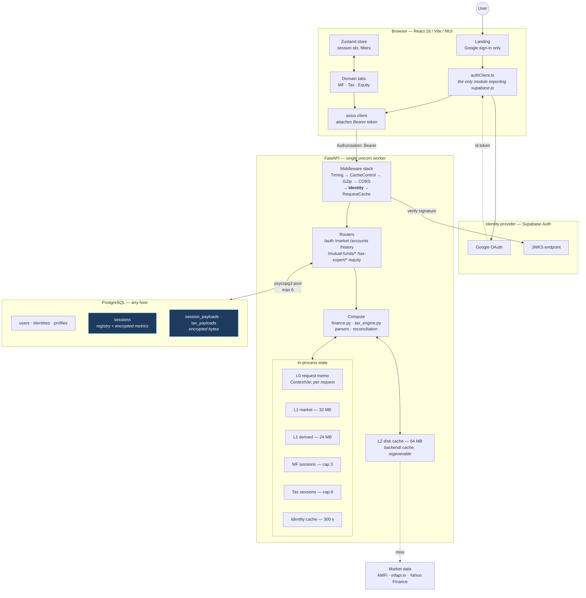
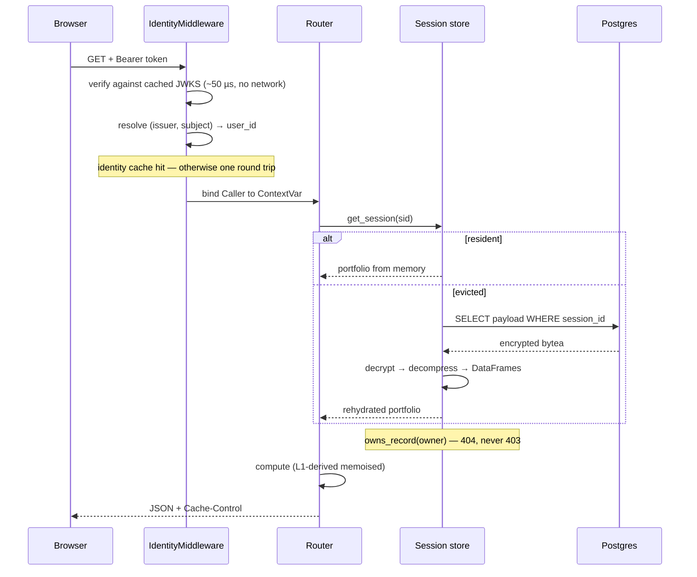
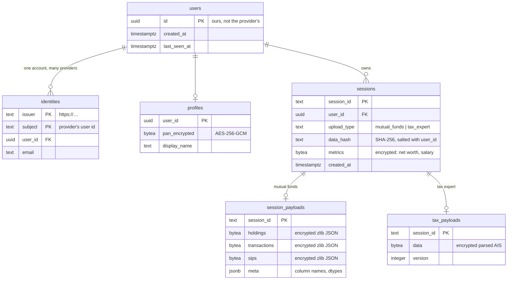

# Finance Buddy — Architecture

Mutual-fund portfolio analytics and Indian income-tax computation, from uploaded CAS
and AIS documents.

This describes the system as it is. Where a design looks unusual, the reason is
stated — most of the unusual choices trace back to one constraint (below) and are
wrong to "clean up" without removing that constraint first.

Companion documents: **ONBOARDING.md** (setting it up, locally and in production) and
**SECURITY.md** (threat model, and what is still open).

---

## The constraint everything else follows from

One uvicorn worker, ~512 MB RAM, ~0.1 shared vCPU, with the database on the far side
of a network hop.

That single fact explains the caching tiers, the payload compression, the connection
pool sizing, the absence of an ORM, and the threadpool cap.

| Decision | Because |
|---|---|
| No ORM — hand-written SQL on psycopg 3 | SQLAlchemy is ~30 MB RSS against a ~50 MB baseline, for a 7-table schema whose payloads are opaque blobs it could not map anyway |
| No Alembic | It requires SQLAlchemy, and autogenerate diffs declarative models — with no models there is nothing to diff, so migrations would be `op.execute()` around this same SQL |
| No Redis | With one worker the in-process caches *are* shared caches; Redis would cost resident memory and buy nothing until there are several workers |
| Sync `def` endpoints, threadpool capped at 8 | 51 of 54 handlers are blocking pandas work. anyio's default of 40 lets them thrash one shared vCPU while each holds its own DataFrames |
| Payloads compressed in the app, not left to TOAST | TOAST decompresses server-side, so it saves storage but not wire bytes. 3.06 MB → 0.81 MB on a 20k-row ledger |

### `--workers 1` is a requirement, not a default

Several parts of the design are *incorrect* with more than one worker, so this is
worth stating plainly before someone raises it to improve throughput:

- **In-process caches stop being shared caches.** L1 lives in process memory. With N
  workers there are N independent copies: N× the resident memory, and a hit rate that
  falls because each worker warms its own.
- **Single-flight stops working across workers.** `get_or_compute` collapses
  concurrent misses into one computation *within* a process. With 4 workers, 4
  simultaneous requests for the same uncached AMFI bundle become 4 downloads again —
  exactly what the caching work removed.
- **512 MB becomes a hard ceiling.** Baseline is ~50 MB per process before any
  portfolio loads, and the L1 budgets (32 + 24 MB) are per-process.
- **Session caps multiply.** 3 and 8 resident sessions become 12 and 32 across four
  workers.

The correct order, if the traffic ever justifies it: move L1 to a shared store,
re-verify the memory budget, *then* add workers. Adding workers alone trades a latency
problem for an OOM.

### Concurrency inside the one worker

51 of 54 endpoints are sync `def`, which FastAPI runs in anyio's threadpool. That pool
defaults to **40** — so up to 40 GIL-bound pandas handlers can contend for ~0.1 shared
vCPU, adding context-switch thrash without any parallelism while each holds its own
intermediate DataFrames.

`main.py` caps it at 8 (`FINANCEBUDDY_SYNC_CONCURRENCY`). Excess requests queue instead
of thrash: slower to *start* serving under burst, faster to finish, and bounded in
memory.

---

## System topology



Highlighted nodes hold application-encrypted data — the database never sees plaintext
for them.

---

## Request lifecycle

A `GET /mutual-funds/overview/{sid}/summary`:



Two things worth noting because they are easy to break:

- **Ownership is checked in the data layer**, inside `get_session()` and
  `get_tax_session()` — not per route. A forgotten `Depends()` on one of ~26 routes is
  a silent hole; there is no way to reach a portfolio without passing through those
  two functions.
- **Denials return 404, not 403.** A 403 confirms the record exists, which is the one
  thing an id-guessing caller wants.

---

## Storage model



### Why identity looks like this

`users.id` is issued by this application, and providers map to it through
`identities(issuer, subject)`. Switching or adding an identity provider is then an
INSERT, not a re-key of every table that carries an owner column.

Nothing references a provider-managed table — no foreign key to Supabase's
`auth.users`. That is the hardest kind of coupling to undo later, and avoiding it is
why the schema applies unchanged to Supabase, Neon, RDS or a local server.

**PAN is not identity.** It used to be the login credential *and* the owner column,
and it is printed on financial documents — so knowing one was enough to read that
user's data. It is now an attribute on `profiles`, used as the CAS PDF password
default and the AIS matching key, deciding nothing about access.

### Why payloads are blobs

The three mutual-fund frames were once three tables created implicitly by
`DataFrame.to_sql`, with schema frozen from whatever columns the first upload
happened to have — and parser drift absorbed by runtime `ALTER TABLE` using
identifiers taken from the uploaded PDF. Postgres would not tolerate that, and it
should not have to.

One row per session, measured on a 20k-row ledger:

| | old (3 tables) | now (1 row) |
|---|---|---|
| write | 391 ms | **324 ms** |
| read | 200 ms | **134 ms** |
| stored | 2.66 MB | **0.81 MB** |
| round trips | 3 | **1** |

Datetimes are stored as integer epoch counts with their **unit** recorded. That
detail is load-bearing: pandas 3 yields `datetime64[us]`, and restoring it as `[ns]`
divides every timestamp by 1000 — turning 2023 into 1970 with nothing raised
anywhere.

---

## Caching

Five tiers, each earning its place:

| Tier | Scope | Size | Holds |
|---|---|---|---|
| **L0** | one request | — | Memoised within a single request, via ContextVar |
| **L1 market** | process | 32 MB | AMFI bundle, NAV series |
| **L1 derived** | process | 24 MB | Computed analytics keyed on input fingerprints |
| **L2 disk** | container | 64 MB | Market data — regenerable, deliberately *not* in Postgres |
| **Sessions** | process | 3 MF / 8 tax | Live portfolios; overflow rehydrates from the database |

Session caps are **cache sizing, not retention**. An evicted session is a read, not
data loss — eviction became safe only once rehydration existed.

L2 stays on disk on purpose: it holds market data any refetch replaces, so putting it
in Postgres would spend the connection and IO budget on something worthless.

---

## Backend layout

```
backend/
├── main.py                     # middleware stack, router mounting, lifespan
├── migrations/                 # numbered .sql + migrate.py (advisory-locked)
├── shared/
│   ├── db.py                   # the ONLY module that opens a connection
│   ├── crypto.py               # AES-256-GCM, row-bound, keyring with rotation
│   ├── oidc.py                 # provider-agnostic token verification
│   ├── identity.py             # Caller ContextVar, owns_record()
│   ├── users.py                # credential → account, cached
│   ├── storage.py              # sessions, payload codec
│   ├── routers/                # auth, market, accounts, history
│   └── services/               # market providers, cache tiers
└── domains/
    ├── mutual_funds/           # 9 routers, finance.py, parser.py, sessions.py
    ├── tax_expert/             # 6 routers, tax_engine.py, AIS/ITR/broker parsers
    └── equity/                 # placeholder
```

Two invariants are enforced by tests rather than convention:

- **Only `shared/db.py` opens a connection.** Seven modules used to open their own;
  five without the busy timeout, so a concurrent upload made them fail outright.
  `test_only_shared_db_opens_connections` fails the build if that returns — and under
  Postgres a stray connection is one that bypasses the pool.
- **Every SQL literal parses as Postgres.** `test_sql_is_valid_postgres` walks the AST
  of every module, parses each statement with sqlglot, and rejects leftover SQLite
  syntax or `?` placeholders. No database required.

---

## Frontend layout

```
frontend/src/
├── domains/
│   ├── mutual-funds/           # components/, hooks/useData.ts
│   ├── tax-expert/             # components/, hooks/useTaxExpert.ts
│   └── equity/                 # placeholder
└── shared/
    ├── auth/authClient.ts      # the only file importing supabase-js
    ├── api/client.ts           # axios + Bearer interceptor + 401 handling
    ├── store/appStore.ts       # Zustand, persisted
    ├── components/             # layout/, dashboard/, charts/, ui/
    └── theme/
```

`authClient.ts` is a deliberate chokepoint. Components call `signIn` / `signOut` /
`getAccessToken`; none import the vendor SDK. Swapping provider is a rewrite of that
one file, because the backend already accepts any OIDC issuer.

---

## URL prefixes

| Domain | Prefix | Example |
|---|---|---|
| Infrastructure | `/auth` `/market` `/accounts` `/history` | `GET /accounts/summary` |
| Mutual funds | `/mutual-funds/{portfolio,overview,holdings,performance,compare,insights,rebalance,journey,planning}` | `GET /mutual-funds/overview/{sid}/summary` |
| Tax expert | `/tax-expert` (one namespace, six routers) | `GET /tax-expert/{sid}/tax/summary` |
| Equity | `/equity` (placeholder) | `GET /equity/status` |

---

## Data handling

The uploaded PDF is never retained — parsers work on `io.BytesIO` and delete any temp
file in a `finally`. Derived data persists until the user deletes it.

An earlier version of this document claimed "zero-persistence privacy" and a
"Zero-Database Architecture". Neither was true then — SQLite was already writing to
disk — and both are the opposite of true now. The accurate statement is above;
SECURITY.md carries the full posture, including what is still open.

Everything sensitive is encrypted by the application before it reaches the database —
not by pgcrypto, whose key travels in the SQL statement and lands in
`pg_stat_statements` and the server log. Each ciphertext is bound to its row via GCM
associated data, so a blob copied into another user's row fails to decrypt rather
than being served to the wrong person.

---

## Market data

A provider interface (`services/providers/base.py`) with `mfapi.in` as the current
implementation, resolved through a factory so business logic never names a vendor.

Benchmarks resolve through a three-tier cascade — AMFI/mfapi → Yahoo Finance (NSE) →
Yahoo Finance (BSE) — and then stop. If all three fail the API returns 503 rather
than falling back to scraping, and the UI surfaces it. Where a heuristic *is* used
(category peer fallback, expense-ratio bands), the response carries
`fallback_triggered: true` and the UI marks the figure rather than presenting an
estimate as measured.

---

## Stack

| Layer | Choice | Notes |
|---|---|---|
| API | FastAPI + uvicorn | one worker — see the constraint above |
| Database | PostgreSQL 11+ via psycopg 3 | `gen_random_uuid()` needs pgcrypto below 13; migration 0001 creates it |
| Compute | pandas, NumPy, PyXirr | vectorised; XIRR above 365 days, absolute return below |
| Parsing | casparser, pdfplumber, pypdf, camelot | camelot lazy-imported — it pulls ~60 MB of OpenCV |
| Auth | OIDC id tokens, PyJWT + cryptography | asymmetric algorithms only, pinned |
| Frontend | React 18, Vite, MUI, Zustand, React Query, Recharts | |

Pinned versions live in `backend/requirements.txt` and `frontend/package.json`, which
are the source of truth — a table here would drift.
