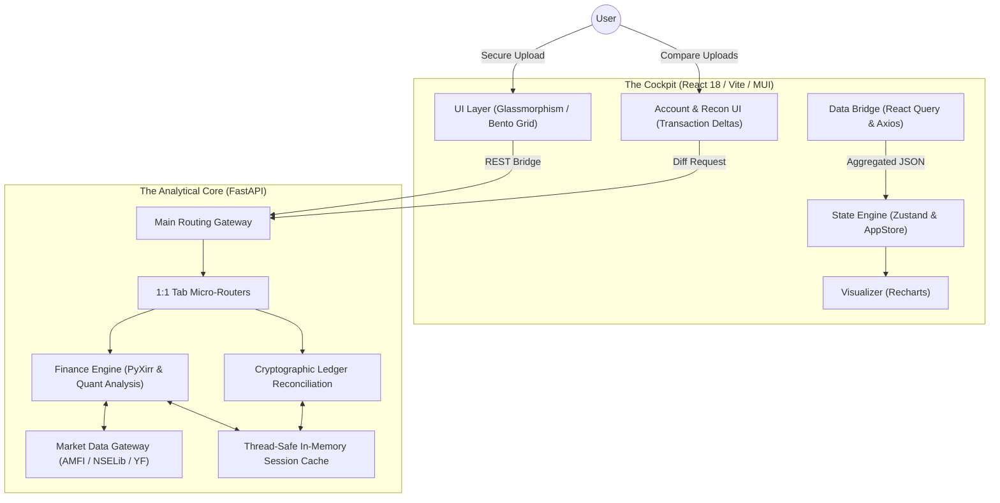

# 💠 Finance Buddy Architecture: The AlphaTrack Pro Blueprint (v9.1)

Finance Buddy is an institutional-grade Mutual Fund Intelligence platform engineered for **absolute numerical precision**, **pure live market data tracking**, and **zero-persistence privacy**. This document outlines the technical scaffolding that enables real-time, audit-quality portfolio analytics.

---

## 🏛️ Design Philosophy: "Stateless Intelligence"
Unlike retail investment trackers, Finance Buddy operates on a **Stateless Analytical Model**.
*   **Zero-Database Architecture**: Sensitive financial data exists only in-memory (volatile RAM) during a session and is purged upon termination or timeout.
*   **Pure Live Data Tracking**: Calculations operate on 100% authentic real-time market data fetched via AMFI, NSELib, and Yahoo Finance without synthetic drift or fabricated data.
*   **FIFO Integrity**: Every calculation—from XIRR to Tax—is derived from the raw transaction ledger using strict First-In-First-Out (FIFO) matching.
*   **Institutional Audit Parity**: Calculations are calibrated to match the reconciliation standards of professional portfolio management services (PMS).

---

## 🏗️ System Topology

Finance Buddy utilizes a **Decoupled Monolith** architecture with a FastAPI-driven analytical core and a high-fidelity React dashboard.

---

## 🐍 Backend Engineering (Python)

### 1. 1:1 Tab Micro-Router Architecture (`routers/tabs/`)
To maximize modularity and maintain clear separation of concerns, the backend is partitioned into dedicated micro-routers that correspond exactly 1:1 with frontend UI tabs:
*   **`overview.py`**: Orchestrates portfolio vs benchmark XIRR, asset allocation, and multi-period comparative performance charts.
*   **`holdings.py`**: Manages individual fund holdings, asset classification, and concentration risk metrics.
*   **`performance.py`**: Computes Jensen's Alpha, Sharpe & Sortino ratios, Maximum Drawdown, market capture ratios, and rolling returns.
*   **`compare.py`**: Multi-dimensional head-to-head comparison engine across historical returns, drawdowns, and expense ratios.
*   **`history.py`**: Cryptographic Ledger Reconciliation, advanced delta analysis (Organic Growth, XIRR Shifts, Dividends) and multi-session timeline orchestration.
*   **`tax_strategy.py`**: Handles comprehensive AIS PDF parsing, Non-Salary TDS extraction, Capital Gains tax simulation (LTCG 12.5%, STCG 20%), Old vs New Regime algorithmic comparison, and dynamic UI deduction math validation.
*   **`insights.py`**: Generates institutional AI quantitative insights and rebalancing signals based on asset drift.
*   **`rebalance.py`**: Formulates step-by-step transaction roadmaps to restore target asset allocation weights.

### 2. Extensible Provider Architecture & Fallback Engine (`services/providers/`)
Finance Buddy relies strictly on real-time market data resolved through a highly resilient, provider-agnostic abstraction layer designed for maximum uptime:
*   **Provider Interface (`base.py`)**: Defines a rigid `MarketDataProvider` contract for fetching NAV, TER, indices, and searching funds. This guarantees "future-proof" design, allowing seamless migration to other data vendors.
*   **Concrete Implementations (`mfapi.py`)**: Current primary data pipeline leveraging `mfapi.in` and `amfiindia.com` for precise institutional mutual fund metrics.
*   **Factory Pattern (`factory.py`)**: Dynamically resolves the active data provider, decoupling business logic from underlying API specifics.

### 3. The Deterministic Fallback Cascade
To guarantee 100% uptime for index proxy benchmarking and portfolio insights, Finance Buddy implements a strict, multi-tiered fallback architecture. If upstream APIs (e.g., AMFI or Yahoo Finance) drop, the system gracefully degrades:
*   **Market Data Routing (The 3-Tier Net)**: Resolves benchmarks via: 1) AMFI/`mfapi.in` -> 2) Yahoo Finance (NSE tickers) -> 3) Yahoo Finance (BSE tickers). If all three fail, the engine triggers a graceful `HTTP 503 Service Unavailable` fail-safe that the React UI catches, deliberately avoiding fragile 4th-tier web scraping.
*   **Category Peer Degradation**: If a highly niche category search returns `0` peers on the Compare Tab, the system automatically degrades the query to a baseline `"Large Cap"` query to populate 15 industry-standard peers, preventing UI crashes.
*   **Deterministic Insights Engine**: If deep fund metadata drops:
    *   **AUM / Risk / Exit Load**: AUM is approximated via market-cap baselines (e.g., ~25,000 Cr for Large Cap), Risk is inferred from taxonomy, and Exit Loads default to SEBI standards.
    *   **Expense Ratio Penalty Markup**: Applies deterministic category bands (e.g., `0.15% - 0.40%` for Debt). If the engine detects a `"REGULAR"` plan name, it intelligently applies an industry-standard `~0.80%` penalty markup to expose high expense drag.
*   **UI Transparency**: All heuristic fallbacks are flagged by the backend (`fallback_triggered: true`). The frontend detects this and instantly renders an Amber Warning Tooltip (`⚠️`) next to the specific metric, ensuring 100% institutional data transparency.

### 4. Tax Intelligence Engine & Parsers (`core/tax_engine.py`, `core/*_parser.py`)
Finance Buddy features a completely autonomous, offline-first Tax Intelligence Engine designed to audit and simulate Indian Income Tax (AY 2026-27). It guarantees mathematical alignment with the official ITR portal rules.

*   **Tax Engine (`tax_engine.py`)**: Implements strict Section 80CCE rules (the ₹1.5L cap), 80CCD(1B) logic, standard deductions, and the progressive tax slab math for both Old and New regimes simultaneously. It automatically selects the optimal regime.
*   **AIS Parser (`ais_parser.py`)**: Uses multi-line, case-insensitive regular expressions (`re.DOTALL | re.IGNORECASE`) to extract Specified Financial Transactions (SFT). Perfectly parses SFT-015 (Dividends), SFT-016 (Savings/TD Interest), and Capital Gains while filtering out duplicate SFT entries reported by multiple depositories.
*   **ITR Parser (`itr_parser.py`)**: Specifically tailored for ITR-1, ITR-2, and ITR-3 PDF layouts. Parses Schedule S (Salaries) to mathematically reconstruct Net Salary from Gross Salary minus Section 10 exemptions and Section 16 deductions.
*   **Broker Reconciliation (`broker_parser.py`)**: Converts raw broker Excel exports into a standardized JSON ledger, enabling cross-verification against the Income Tax Department's AIS values.

### 5. Unified Finance Core (`core/finance.py`)
Powered by vectorised processing via Pandas and NumPy, calculating unitized daily accounting ledgers, rolling return averages, and accurate money-weighted XIRR compounding.

**Institutional Accounting Standards**: 
To prevent mathematical distortion and comply with standard SEBI reporting practices, the core finance engine applies a strict threshold:
*   **Annualized Return (XIRR)**: Used exclusively for portfolios and investments held for **greater than 365 days**.
*   **Absolute Return**: Automatically triggered for investments held for **less than 365 days**. The UI dynamically updates tooltips and badges (`ABS`) to transparently communicate this standard to the user.

---

## ⚛️ Frontend Engineering (React)

### 1. The "AlphaTrack Pro" Design Language
The UI follows a professional financial interface standard inspired by institutional quantitative terminals:
*   **Bento Grid Layouts**: High-contrast, self-contained executive KPI cards with distinct status accents.
*   **Glassmorphic Surfaces**: Deep navy backdrops (`#0B1326`) with 32px Gaussian blur overlays and 1px hairline borders.
*   **Kinetic Micro-Interactions**: Framer Motion transitions and responsive micro-animations for an immersive cockpit feel.

### 2. Specialized UI Modules
*   **Interactive Multi-Series Charts**: Recharts-powered graphs displaying portfolio vs benchmark NAV histories with dynamic tooltip attribution.
*   **Institutional Audit Modals**: Granular drill-downs revealing precise purchase dates, NAV at buy, and tax exemption accounting.

---

## 📈 Technical Specifications

| Layer | Technology | Role |
| :--- | :--- | :--- |
| **Backend API** | FastAPI / Uvicorn | High-concurrency analytical API server |
| **Computation** | Pandas / NumPy | Vectorized financial ledger & cashflow processing |
| **Math Engine** | PyXirr | SEC-compliant XIRR money-weighted compounding |
| **CAS PDF Parsing** | Casparser | SEC-standard CAS PDF extraction |
| **Frontend Framework**| React 18 / Vite / TS | Modular, strongly-typed component dashboard |
| **UI Design System**| MUI v5 / Vanilla CSS | Glassmorphic design tokens & responsive grids |
| **State & Fetching**| Zustand / React Query | Server-state caching & reactive UI store |

---

## 🛡️ Security & Privacy Mandate
1.  **Thread-Safe RAM Locking**: Portfolios are stored in thread-safe RAM segments during the active session.
2.  **Transient Buffering**: No file writes to disk. CAS PDFs are processed entirely via `io.BytesIO` streams.
3.  **Local Isolation**: Designed for zero-telemetry operation; data never leaves the local session environment.

---
*Blueprint Version: 9.2.0 (Institutional Tax Engine & Parser Optimization)*
