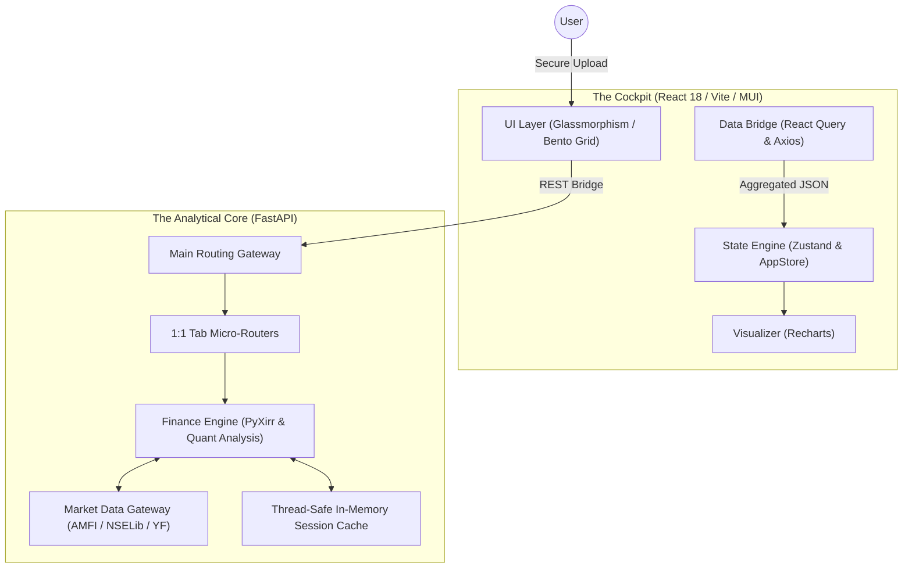

# 💠 FolioIQ Architecture: The AlphaTrack Pro Blueprint (v8.0)

FolioIQ is an institutional-grade Mutual Fund Intelligence platform engineered for **absolute numerical precision**, **pure live market data tracking**, and **zero-persistence privacy**. This document outlines the technical scaffolding that enables real-time, audit-quality portfolio analytics.

---

## 🏛️ Design Philosophy: "Stateless Intelligence"
Unlike retail investment trackers, FolioIQ operates on a **Stateless Analytical Model**.
*   **Zero-Database Architecture**: Sensitive financial data exists only in-memory (volatile RAM) during a session and is purged upon termination or timeout.
*   **Pure Live Data Tracking**: Calculations operate on 100% authentic real-time market data fetched via AMFI, NSELib, and Yahoo Finance without synthetic drift or fabricated data.
*   **FIFO Integrity**: Every calculation—from XIRR to Tax—is derived from the raw transaction ledger using strict First-In-First-Out (FIFO) matching.
*   **Institutional Audit Parity**: Calculations are calibrated to match the reconciliation standards of professional portfolio management services (PMS).

---

## 🏗️ System Topology

FolioIQ utilizes a **Decoupled Monolith** architecture with a FastAPI-driven analytical core and a high-fidelity React dashboard.

---

## 🐍 Backend Engineering (Python)

### 1. 1:1 Tab Micro-Router Architecture (`routers/tabs/`)
To maximize modularity and maintain clear separation of concerns, the backend is partitioned into dedicated micro-routers that correspond exactly 1:1 with frontend UI tabs:
*   **`overview.py`**: Orchestrates portfolio vs benchmark XIRR, asset allocation, and multi-period comparative performance charts.
*   **`holdings.py`**: Manages individual fund holdings, asset classification, and concentration risk metrics.
*   **`performance.py`**: Computes Jensen's Alpha, Sharpe & Sortino ratios, Maximum Drawdown, market capture ratios, and rolling returns.
*   **`compare.py`**: Multi-dimensional head-to-head comparison engine across historical returns, drawdowns, and expense ratios.
*   **`tax_strategy.py`**: Handles FY-specific tax simulation (LTCG 12.5%, STCG 20%, grandfathering rules) and tax-loss harvesting opportunities.
*   **`insights.py`**: Generates institutional AI quantitative insights and rebalancing signals based on asset drift.
*   **`rebalance.py`**: Formulates step-by-step transaction roadmaps to restore target asset allocation weights.

### 2. Pure Live Data Gateway (`services/market_data.py` & `market_indices.py`)
FolioIQ relies strictly on real-time market data resolved through a robust multi-tier hierarchy:
1.  **Exact ISIN Resolution**: Primary query against `mfapi.in` using AMFI ISIN identifiers (`INF...`).
2.  **AMFI Scheme Code Lookup**: Fallback resolution matching exact AMFI scheme codes (`122639`, etc.) from official AMFI master lists.
3.  **Fuzzy Name Matching**: Intelligent fallback query matching normalized mutual fund names across active exchange registries.
4.  **Live Benchmark Caching**: Real-time Nifty 50 NseLib and Yahoo Finance tracking protected by thread-safe locking and customizable TTLs.

### 3. Unified Finance Core (`core/finance.py`)
Powered by vectorised processing via Pandas and NumPy, calculating unitized daily accounting ledgers, rolling return averages, and accurate money-weighted XIRR compounding.

---

## ⚛️ Frontend Engineering (React)

### 1. The "AlphaTrack Pro" Design Language
The UI follows a professional financial interface standard inspired by institutional quantitative terminals:
*   **Bento Grid Layouts**: High-contrast, self-contained executive KPI cards with distinct status accents.
*   **Glassmorphic Surfaces**: Deep navy backdrops (`#0B1326`) with 32px Gaussian blur overlays and 1px hairline borders.
*   **Kinetic Micro-Interactions**: Framer Motion transitions and responsive micro-animations for an immersive cockpit feel.

### 2. Specialized UI Modules
*   **Interactive Multi-Series Charts**: Recharts-powered graphs displaying portfolio vs benchmark NAV histories with dynamic tooltip attribution.
*   **Institutional Audit Modals**: Granular drill-downs revealing precise purchase dates, NAV at buy, and tax exemption accounting.

---

## 📈 Technical Specifications

| Layer | Technology | Role |
| :--- | :--- | :--- |
| **Backend API** | FastAPI / Uvicorn | High-concurrency analytical API server |
| **Computation** | Pandas / NumPy | Vectorized financial ledger & cashflow processing |
| **Math Engine** | PyXirr | SEC-compliant XIRR money-weighted compounding |
| **CAS PDF Parsing** | Casparser | SEC-standard CAS PDF extraction |
| **Frontend Framework**| React 18 / Vite / TS | Modular, strongly-typed component dashboard |
| **UI Design System**| MUI v5 / Vanilla CSS | Glassmorphic design tokens & responsive grids |
| **State & Fetching**| Zustand / React Query | Server-state caching & reactive UI store |

---

## 🛡️ Security & Privacy Mandate
1.  **Thread-Safe RAM Locking**: Portfolios are stored in thread-safe RAM segments during the active session.
2.  **Transient Buffering**: No file writes to disk. CAS PDFs are processed entirely via `io.BytesIO` streams.
3.  **Local Isolation**: Designed for zero-telemetry operation; data never leaves the local session environment.

---
*Blueprint Version: 8.0.0 (Institutional Live Data Update)*
