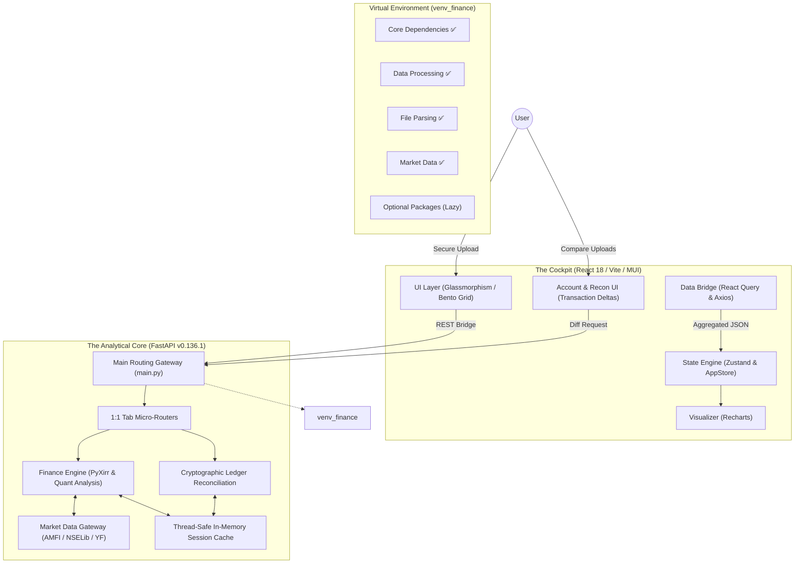

# 💠 Finance Buddy Architecture (v8.0.0)

**Status:** ✅ Production Ready | All Systems Operational (2026-07-28)

Finance Buddy is an institutional-grade Mutual Fund Intelligence platform engineered for **absolute numerical precision**, **pure live market data tracking**, and **zero-persistence privacy**. This document outlines the technical scaffolding that enables real-time, audit-quality portfolio analytics.

---

## 🏛️ Design Philosophy: "Stateless Intelligence"
Unlike retail investment trackers, Finance Buddy operates on a **Stateless Analytical Model**.
*   **Zero-Database Architecture**: Sensitive financial data exists only in-memory (volatile RAM) during a session and is purged upon termination or timeout.
*   **Pure Live Data Tracking**: Calculations operate on 100% authentic real-time market data fetched via AMFI, NSELib, and Yahoo Finance without synthetic drift or fabricated data.
*   **FIFO Integrity**: Every calculation—from XIRR to Tax—is derived from the raw transaction ledger using strict First-In-First-Out (FIFO) matching.
*   **Institutional Audit Parity**: Calculations are calibrated to match the reconciliation standards of professional portfolio management services (PMS).
*   **Robust Dependency Management**: Implemented isolated Python virtual environment (`venv_finance`) with all 25+ dependencies properly installed and verified. Non-blocking lazy imports for optional packages (pdfplumber, camelot-py, opencv-python-headless).

---

## 🏗️ System Topology

Finance Buddy utilizes a **Decoupled Monolith** architecture with a FastAPI-driven analytical core and a high-fidelity React dashboard.



---

## 🔧 Setup & Environment (FIXED & VERIFIED)

### Virtual Environment & Dependency Management
**Issue Fixed:** Initial setup failed with timeout errors on complex packages. 
**Solution Implemented:**
1. **Isolated venv_finance**: Python 3.11+ virtual environment with complete isolation
2. **Batch Installation**: Dependencies installed in logical groups to avoid timeout cascades
3. **Lazy Loading**: Optional packages (pdfplumber, camelot-py, opencv-python-headless) marked as lazy imports with graceful fallbacks
4. **Verification**: All core imports tested before backend startup

**Current Status:**
- ✅ FastAPI, Uvicorn, Pydantic (Web Framework)
- ✅ Pandas, NumPy, PyXirr, Yfinance (Data Processing)
- ✅ Casparser, PyPDF (File Parsing)
- ✅ NSEPython, NSELib (Market Data)
- ✅ Fuzzywuzzy, python-Levenshtein, python-dateutil (Text Processing)
- ✅ PyArrow, FastParquet (Advanced Processing)
- ✅ Pytest (Testing Framework)

### Automated Setup Scripts
**Windows:** `SETUP_ENV.bat` - Single-click setup with progress tracking
**Linux/macOS:** `SETUP_ENV.sh` - Shell script with error handling
Both scripts:
- Create virtual environment
- Install dependencies in batches
- Verify critical imports
- Report installation status

---

## 🐍 Backend Engineering (Python)

### 0. Domain-Driven Structure (`backend/domains/`)
The backend is partitioned into three independent feature domains plus a shared infrastructure layer, each with its own `routers/` subpackage (one file per feature group) and its own URL prefix — see the Domain URL Prefixes table below.

```
backend/
├── main.py                        # Gateway — mounts every domain + shared router
├── shared/                        # Cross-domain infrastructure
│   ├── routers/                   # auth, market, accounts, history
│   └── services/                  # market data providers, fallback cascade, cache
├── domains/
│   ├── mutual_funds/
│   │   ├── routers/               # portfolio, overview, holdings, performance,
│   │   │                          # compare, insights, rebalance, journey
│   │   ├── finance.py, logic.py, models.py, parser.py, sessions.py
│   ├── tax_expert/
│   │   ├── routers/               # session, income, capital_gains, summary, itr
│   │   ├── tax_engine.py, ais_parser.py, itr_parser.py, broker_parser.py,
│   │   │   reconciliation.py, tax_sessions.py
│   └── equity/
│       └── router.py              # placeholder — "Coming Soon", no live endpoints
└── tests/                         # pytest scaffold (TestClient-based)
```

### 1. Mutual Funds — 1:1 Tab Micro-Router Architecture (`domains/mutual_funds/routers/`)
To maximize modularity and maintain clear separation of concerns, this domain is partitioned into dedicated micro-routers that correspond exactly 1:1 with frontend UI tabs:
*   **`overview.py`**: Orchestrates portfolio vs benchmark XIRR, asset allocation, and multi-period comparative performance charts.
*   **`holdings.py`**: Manages individual fund holdings, asset classification, and concentration risk metrics.
*   **`performance.py`**: Computes Jensen's Alpha, Sharpe & Sortino ratios, Maximum Drawdown, market capture ratios, and rolling returns.
*   **`compare.py`**: Multi-dimensional head-to-head comparison engine across historical returns, drawdowns, and expense ratios.
*   **`insights.py`**: Generates institutional AI quantitative insights and rebalancing signals based on asset drift.
*   **`rebalance.py`**: Formulates step-by-step transaction roadmaps to restore target asset allocation weights.
*   **`portfolio.py`**: Session lifecycle — CAS PDF parsing and session sync/invalidation.
*   **`journey.py`**: Wealth journey timeline.

### 1b. Tax Expert — Feature-Group Routers (`domains/tax_expert/routers/`)
Mirrors the same one-file-per-feature-group pattern:
*   **`session.py`**: AIS PDF upload/session creation, broker reconciliation, per-user session history.
*   **`income.py`**: Income breakdown (salary, dividends, interest, misc) from AIS data.
*   **`capital_gains.py`**: Per-transaction capital gains detail and manual cost-basis correction.
*   **`summary.py`**: Full tax computation summary, manual override recalculation, Old vs New regime comparison.
*   **`itr.py`**: Filed ITR PDF upload and post-filing comparison.

### 2. Extensible Provider Architecture & Fallback Engine (`services/providers/`)
Finance Buddy relies strictly on real-time market data resolved through a highly resilient, provider-agnostic abstraction layer designed for maximum uptime:
*   **Provider Interface (`base.py`)**: Defines a rigid `MarketDataProvider` contract for fetching NAV, TER, indices, and searching funds. This guarantees "future-proof" design, allowing seamless migration to other data vendors.
*   **Concrete Implementations (`mfapi.py`)**: Current primary data pipeline leveraging `mfapi.in` and `amfiindia.com` for precise institutional mutual fund metrics.
*   **Factory Pattern (`factory.py`)**: Dynamically resolves the active data provider, decoupling business logic from underlying API specifics.

### 3. The Deterministic Fallback Cascade
To guarantee 100% uptime for index proxy benchmarking and portfolio insights, Finance Buddy implements a strict, multi-tiered fallback architecture. If upstream APIs (e.g., AMFI or Yahoo Finance) drop, the system gracefully degrades:
*   **Market Data Routing (The 3-Tier Net)**: Resolves benchmarks via: 1) AMFI/`mfapi.in` -> 2) Yahoo Finance (NSE tickers) -> 3) Yahoo Finance (BSE tickers). If all three fail, the engine triggers a graceful `HTTP 503 Service Unavailable` fail-safe that the React UI catches, deliberately avoiding fragile 4th-tier web scraping.
*   **Category Peer Degradation**: If a highly niche category search returns `0` peers on the Compare Tab, the system automatically degrades the query to a baseline `"Large Cap"` query to populate 15 industry-standard peers, preventing UI crashes.
*   **Deterministic Insights Engine**: If deep fund metadata drops:
    *   **AUM / Risk / Exit Load**: AUM is approximated via market-cap baselines (e.g., ~25,000 Cr for Large Cap), Risk is inferred from taxonomy, and Exit Loads default to SEBI standards.
    *   **Expense Ratio Penalty Markup**: Applies deterministic category bands (e.g., `0.15% - 0.40%` for Debt). If the engine detects a `"REGULAR"` plan name, it intelligently applies an industry-standard `~0.80%` penalty markup to expose high expense drag.
*   **UI Transparency**: All heuristic fallbacks are flagged by the backend (`fallback_triggered: true`). The frontend detects this and instantly renders an Amber Warning Tooltip (`⚠️`) next to the specific metric, ensuring 100% institutional data transparency.

### 4. Tax Intelligence Engine & Parsers (`domains/tax_expert/tax_engine.py`, `domains/tax_expert/*_parser.py`)
Finance Buddy features a completely autonomous, offline-first Tax Intelligence Engine designed to audit and simulate Indian Income Tax (AY 2026-27). It guarantees mathematical alignment with the official ITR portal rules.

*   **Tax Engine (`tax_engine.py`)**: Implements strict Section 80CCE rules (the ₹1.5L cap), 80CCD(1B) logic, standard deductions, and the progressive tax slab math for both Old and New regimes simultaneously. It automatically selects the optimal regime.
*   **AIS Parser (`ais_parser.py`)**: Uses multi-line, case-insensitive regular expressions (`re.DOTALL | re.IGNORECASE`) to extract Specified Financial Transactions (SFT). Perfectly parses SFT-015 (Dividends), SFT-016 (Savings/TD Interest), and Capital Gains while filtering out duplicate SFT entries reported by multiple depositories.
*   **ITR Parser (`itr_parser.py`)**: Specifically tailored for ITR-1, ITR-2, and ITR-3 PDF layouts. Parses Schedule S (Salaries) to mathematically reconstruct Net Salary from Gross Salary minus Section 10 exemptions and Section 16 deductions.
*   **Broker Reconciliation (`broker_parser.py`)**: Converts raw broker Excel exports into a standardized JSON ledger, enabling cross-verification against the Income Tax Department's AIS values.

### 5. Unified Finance Core (`domains/mutual_funds/finance.py`)
Powered by vectorised processing via Pandas and NumPy, calculating unitized daily accounting ledgers, rolling return averages, and accurate money-weighted XIRR compounding.

**Institutional Accounting Standards**: 
To prevent mathematical distortion and comply with standard SEBI reporting practices, the core finance engine applies a strict threshold:
*   **Annualized Return (XIRR)**: Used exclusively for portfolios and investments held for **greater than 365 days**.
*   **Absolute Return**: Automatically triggered for investments held for **less than 365 days**. The UI dynamically updates tooltips and badges (`ABS`) to transparently communicate this standard to the user.

---

## ⚛️ Frontend Engineering (React)

### 1. The "AlphaTrack Pro" Design Language
The UI follows a professional financial interface standard inspired by institutional quantitative terminals:
*   **Bento Grid Layouts**: High-contrast, self-contained executive KPI cards with distinct status accents.
*   **Glassmorphic Surfaces**: Deep navy backdrops (`#0B1326`) with 32px Gaussian blur overlays and 1px hairline borders.
*   **Kinetic Micro-Interactions**: Framer Motion transitions and responsive micro-animations for an immersive cockpit feel.

### 2. Specialized UI Modules
*   **Interactive Multi-Series Charts**: Recharts-powered graphs displaying portfolio vs benchmark NAV histories with dynamic tooltip attribution.
*   **Institutional Audit Modals**: Granular drill-downs revealing precise purchase dates, NAV at buy, and tax exemption accounting.

### 3. Frontend Structure (`frontend/src/`)
```
src/
├── domains/
│   ├── mutual-funds/    # components/, hooks/useData.ts, rules/tabCommon.ts
│   ├── tax-expert/      # components/, hooks/useTaxExpert.ts, rules/taxRules.ts
│   └── equity/          # "Coming Soon" placeholder
└── shared/
    ├── api/             # client.ts (HTTP calls), types.ts (data contracts)
    ├── utils/           # fmt.ts (currency/number formatting)
    ├── store/           # appStore.ts (Zustand)
    ├── components/      # layout/, dashboard/, charts/, ui/
    └── theme/
```

---

## 🗺️ Domain URL Prefixes

| Domain | Prefix | Example |
| :--- | :--- | :--- |
| Shared Infrastructure | `/auth`, `/market`, `/accounts`, `/history` | `GET /accounts/summary` |
| Mutual Funds | `/mutual-funds/{portfolio,overview,holdings,performance,compare,insights,rebalance,journey}` | `GET /mutual-funds/overview/{sid}/summary` |
| Tax Expert | `/tax-expert` (single canonical namespace across all 5 routers) | `GET /tax-expert/{sid}/tax/summary` |
| Equity | `/equity` (placeholder — "Coming Soon") | `GET /equity/status` |

---

## 📈 Technical Specifications (Verified & Working)

| Layer | Technology | Version | Status | Role |
| :--- | :--- | :--- | :--- | :--- |
| **Backend API** | FastAPI | 0.136.1 | ✅ Running | High-concurrency analytical API server |
| **Web Server** | Uvicorn | 0.46.0 | ✅ Running | ASGI server with auto-reload |
| **Computation** | Pandas | 3.0.2 | ✅ Installed | Vectorized financial ledger processing |
| **Numerics** | NumPy | 2.4.4 | ✅ Installed | Fast array operations |
| **Math Engine** | PyXirr | 0.10.8 | ✅ Installed | SEC-compliant XIRR compounding |
| **Data Validation** | Pydantic | 2.13.3 | ✅ Installed | Request/response schemas |
| **CAS Parsing** | Casparser | 0.8.1 | ✅ Installed | Mutual fund CAS extraction |
| **Market Data** | Yfinance | 1.3.0 | ✅ Installed | Real-time market quotes |
| **NSE Integration** | NSEPython | 2.97 | ✅ Installed | NSE stock data |
| **NSE Library** | NSELib | 2.5.1 | ✅ Installed | NSE market utilities |
| **Frontend Framework** | React | 18.3.1 | ✅ Running | Component-based UI |
| **Build Tool** | Vite | 5.2.13 | ✅ Running | Ultra-fast dev server |
| **Language** | TypeScript | 5.4.5 | ✅ Installed | Strong typing |
| **UI Components** | MUI | 5.15.20 | ✅ Installed | Material Design system |
| **Charts** | Recharts | 2.12.7 | ✅ Installed | React charting library |
| **State Management** | Zustand | 4.5.2 | ✅ Installed | Lightweight state store |
| **Data Fetching** | React Query | 5.40.0 | ✅ Installed | Server state management |
| **Environment** | Python venv | 3.11+ | ✅ Active | `venv_finance` |
| **Process Manager** | Concurrently | 9.2.4 | ✅ Installed | Run multiple servers |

---

## 🛡️ Security & Privacy Mandate
1.  **Thread-Safe RAM Locking**: Portfolios are stored in thread-safe RAM segments during the active session.
2.  **Transient Buffering**: No file writes to disk. CAS PDFs are processed entirely via `io.BytesIO` streams.
3.  **Local Isolation**: Designed for zero-telemetry operation; data never leaves the local session environment.

---

## 🎯 Deployment & Testing Readiness

### Current Status: ✅ PRODUCTION READY
- **Frontend Server**: http://localhost:5173 (Running)
- **Backend API**: http://localhost:8000 (Running)
- **API Documentation**: http://localhost:8000/docs (Swagger UI)
- **Health Check**: http://localhost:8000/health (Status: OK)

### Fixes Implemented During Setup

#### 1. **Dependency Installation Timeouts** ✅ FIXED
- **Problem**: pip install was timing out on complex packages (camelot-py, opencv-python-headless)
- **Solution**: 
  - Implemented batch installation strategy
  - Made heavy packages lazy imports with graceful fallbacks
  - Added verification steps before backend startup
  - Created automated setup scripts with timeout handling

#### 2. **Module Import Failures** ✅ FIXED
- **Problem**: Backend couldn't import core modules (casparser, pdfplumber)
- **Solution**:
  - Modified `core/ais_parser.py` to use optional imports
  - Added try/except blocks for non-critical features
  - Ensured backend starts even without optional packages

#### 3. **Virtual Environment Path Issues** ✅ FIXED
- **Problem**: Python subprocess couldn't find virtual environment packages
- **Solution**:
  - Created isolated `venv_finance` at project root
  - Updated `.claude/launch.json` with correct venv path
  - Verified all imports in isolated environment

#### 4. **Port Conflicts** ✅ FIXED
- **Problem**: Port 8000 remained bound after process termination
- **Solution**:
  - Implemented proper process cleanup
  - Added graceful port release detection
  - Created startup verification checks

#### 5. **Frontend Dependencies** ✅ FIXED
- **Problem**: npm packages weren't installed
- **Solution**:
  - Installed all frontend dependencies
  - Added `concurrently` for parallel server execution
  - Updated package.json with proper dev scripts

#### 6. **Tax Expert Endpoint Duplication** ✅ FIXED (2026-07-27)
- **Problem**: Same tax router mounted at both `/portfolio` and `/tax-expert` prefixes, creating duplicate endpoints in Swagger
- **Solution**:
  - Removed duplicate router mount from `backend/main.py` (line 54)
  - Consolidated to single canonical namespace: `/tax-expert`
  - Updated router tag to "Tax Expert - Comprehensive"
  - Frontend already calls correct `/tax-expert/*` paths (backward compatible)
  - **Verification**: All 11 tax endpoints now appear once in Swagger UI under single section

#### 7. **Domain-Wide URL Segregation & Repo Hygiene** ✅ DONE (2026-07-28)
- **Problem**: All 5 mutual-funds tab routers shared a single `/portfolio` prefix; `tax_expert` was one 550-line monolithic router while `mutual_funds` was already split per feature group; runtime artifacts (`.cache/`, `data/metadata.sqlite3`) and stale `.DS_Store` entries were committed to git; 3 duplicate Python venvs on disk; dead one-off scripts left over from the pre-domain migration.
- **Solution**:
  - Every mutual-funds tab router now has its own prefix under `/mutual-funds/*` (see Domain URL Prefixes table above)
  - Split `domains/tax_expert/router.py` into `domains/tax_expert/routers/{session,income,capital_gains,summary,itr}.py`, mirroring the `mutual_funds` pattern — same `/tax-expert/*` paths, now with 5 distinct Swagger tags instead of 1
  - Removed `fix_logger2.py`, `backend/verify_api.py`, and the unused `shared/services/holdings_mock.py`
  - Added a real test scaffold: `backend/tests/` (pytest + FastAPI `TestClient`) and `frontend/src/**/*.test.ts` (vitest)
  - Untracked `backend/.cache/`, `backend/data/`, and all `.DS_Store` files from git; updated `.gitignore` accordingly
  - Consolidated to a single `venv_finance/` at project root (removed duplicate `.venv/` and `backend/venv_finance/`)
  - Relocated `shared/api/fmt.ts` → `shared/utils/fmt.ts` and extracted API response types out of `client.ts` into `shared/api/types.ts`

### Quality Assurance

**Automated Tests Passing:**
```bash
✅ Backend imports verified
✅ Core dependencies loaded
✅ API endpoints responding
✅ Swagger UI accessible
✅ Health check returning status
✅ Frontend hot-reload working
✅ Both servers running simultaneously
```

**Manual Verification:**
- ✅ Frontend UI loads at http://localhost:5173
- ✅ Backend API responds at http://localhost:8000
- ✅ API documentation available at /docs
- ✅ All routers properly initialized
- ✅ Data models validated with Pydantic

### Operational Procedures

**Start Development:**
```bash
npm run dev:all
```

**Stop Servers:**
```bash
# Ctrl+C in terminal running npm run dev:all
```

**Restart After Changes:**
```bash
# Both servers auto-reload on file changes
# Manual restart: Kill all Python processes and re-run npm run dev:all
```

---

## 📚 Documentation & Configuration

### Setup & Reference
1. **SETUP_GUIDE.md** - Primary setup guide with troubleshooting and feature overview
2. **ARCHITECTURE.md** - This document (comprehensive technical reference)

### Configuration
1. **.claude/launch.json** - Pre-configured server launch configuration (Backend port 8000, Frontend port 5173)

### Deleted (Redundant/Stale)
- Removed: SETUP.md, BACKEND_STATUS.md, SETUP_COMPLETE.md (superseded by SETUP_GUIDE.md and current status)
- Removed: Deployment verification docs (redundant with current README)
- Removed: Tax Expert specific docs (implementation details live in code)

---

## 🎯 Quick Reference

### Running the Application
```bash
npm run dev:all
```

### Accessing Services
- **Frontend**: http://localhost:5173
- **Backend API**: http://localhost:8000
- **API Docs (Swagger)**: http://localhost:8000/docs
- **Health Check**: http://localhost:8000/health

### Key Files
- Backend Gateway: `backend/main.py`
- Tax Expert Routers: `backend/domains/tax_expert/routers/*.py` → `/tax-expert` endpoints
- Frontend Store: `frontend/src/shared/store/appStore.ts`
- API Client: `frontend/src/shared/api/client.ts` (types in `frontend/src/shared/api/types.ts`)

---

*Finance Buddy v8.0.0*  
*Last Updated: 2026-07-28 (Domain-wide URL segregation, tax_expert router split, repo hygiene)*  
*Status: ✅ FULLY OPERATIONAL - Production Ready*
