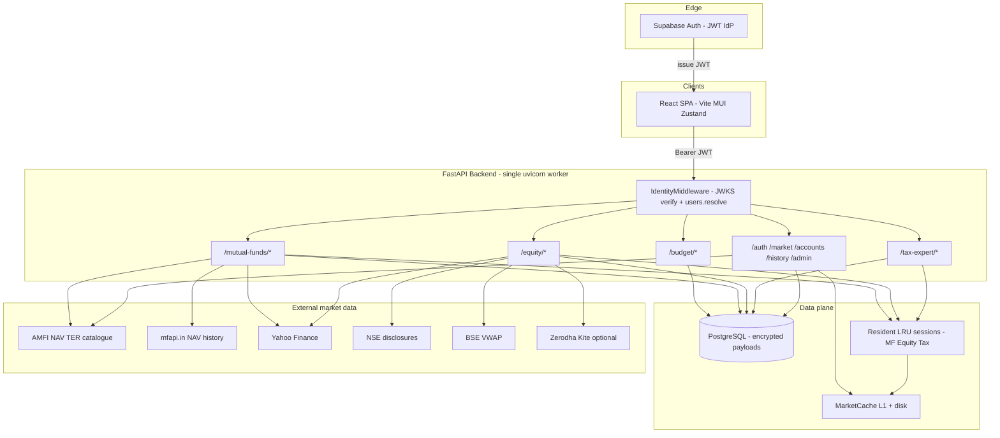
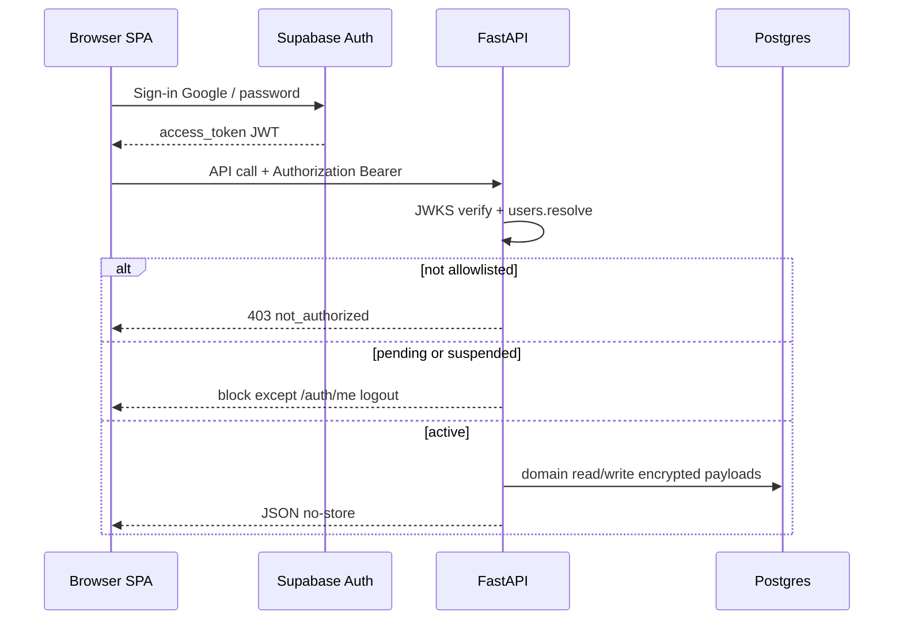
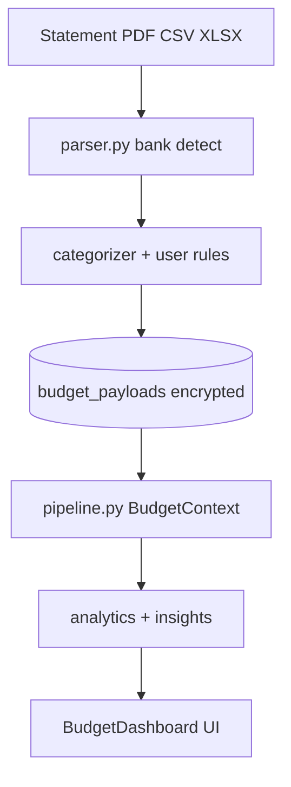
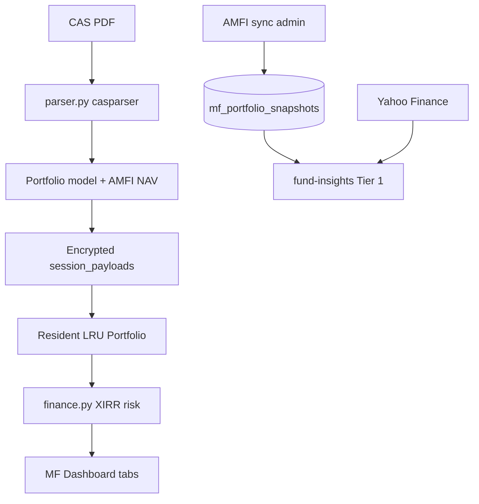
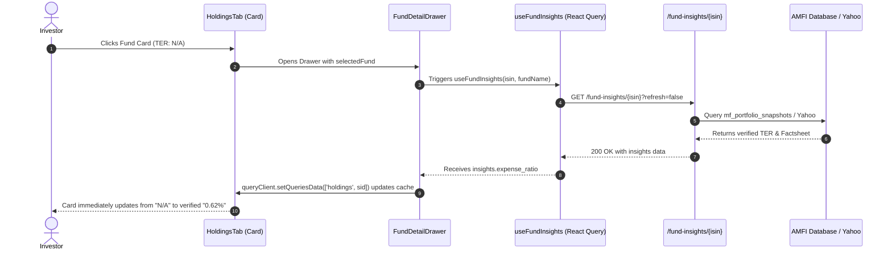
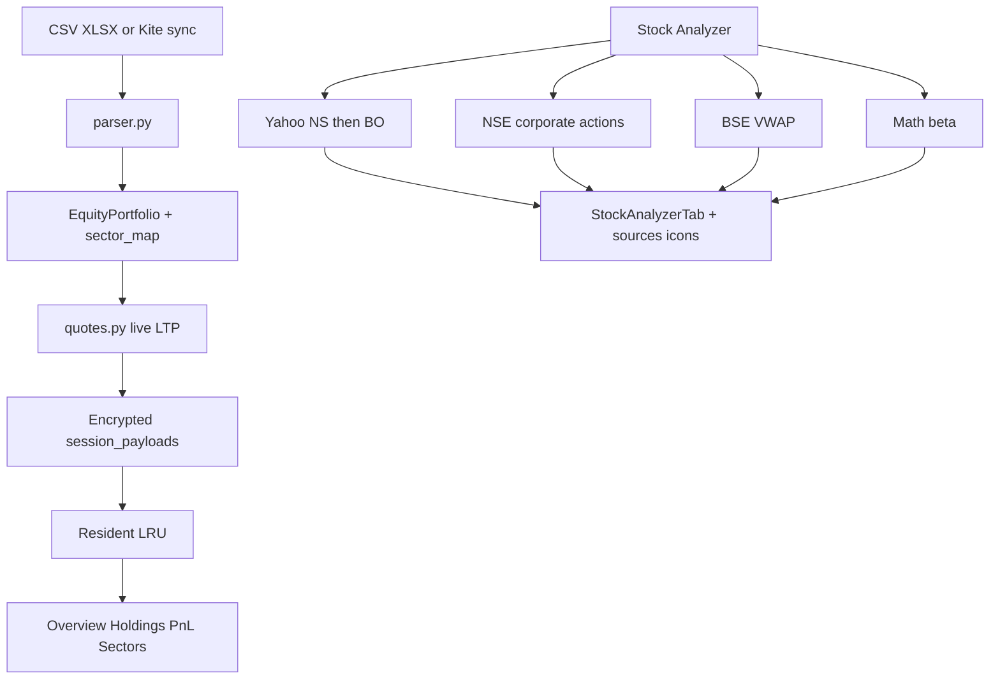
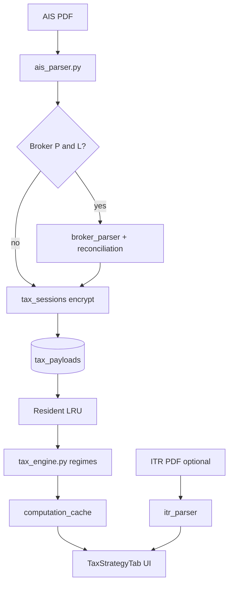

# Finance Buddy — Architecture

**Single source of truth** for how Finance Buddy is built and how its four domains
work end-to-end. This describes the system as it is.

Companion docs (operations only — not architecture duplicates):

| Doc | Role |
|---|---|
| [ONBOARDING.md](ONBOARDING.md) | Local + production setup |
| [API.md](API.md) | How to call APIs & pass Bearer tokens (`/auth` catalog) |
| [VERIFICATION.md](VERIFICATION.md) | Setup / deploy checks |
| [MIGRATION.md](MIGRATION.md) | Moving off Supabase Auth, DB, or both |

---

## 1. System overview

Finance Buddy is a personal finance analytics platform with **four independent
domains** plus shared infrastructure:

| Domain | Job |
|---|---|
| **Budget Analyzer** | Bank-statement cash-flow intelligence (50/30/20, categories, insights) |
| **Mutual Funds** | CAS portfolio analytics (XIRR, allocation, peers, rebalance, tax-harvest) |
| **Equity** | Direct stock holdings, P&L, sectors, stock research analyzer |
| **Tax Expert** | AIS-driven income-tax computation, regime compare, broker reconcile |



### Design constraint

Domains must stay **independently removable**. Cross-domain fan-out goes through
registries (`janitor`, `session_stores`), not hardcoded import lists. Unusual
choices usually exist because of that constraint — do not “clean them up” without
removing the constraint first.

---

## 2. API prefixes & frontend routes

### API

| Domain | Prefix | Routers | Example |
|---|---|---|---|
| Infrastructure | `/auth` `/market` `/accounts` `/history` `/admin` | shared | `GET /auth/me` |
| Budget | `/budget/{portfolio,analytics,rules,accounts,insights}` | 5 | `POST /budget/portfolio/upload` |
| Mutual Funds | `/mutual-funds/*` | 9 | `GET /mutual-funds/overview/{sid}/summary` |
| Equity | `/equity/*` | 6 | `GET /equity/overview/{sid}/summary` |
| Tax Expert | `/tax-expert` | 6 | `GET /tax-expert/{sid}/tax/summary` |

Full `/auth` method catalog: **[API.md](API.md)**.

### Frontend

| Path | Renders |
|---|---|
| `/` | Landing (out) · → `/dashboard` (in) |
| `/dashboard` | Domain hub |
| `/mutual-funds/*` | MF tabs |
| `/equity/*` | Equity tabs |
| `/tax-expert/*` | Tax Expert |
| `/budget/*` | Budget Analyzer |
| `/accounts` | Export / purge |
| `/profile` | Profile + PAN |
| `/admin` | Admin Console (`role=admin`) |

Legacy `/dashboard/<domain>` rewrites to `/<domain>` (`routes.test.ts`).

---

## 3. Repository layout

```
backend/
├── main.py                     # middleware, router mount, lifespan
├── migrations/                 # 0001–0010 SQL
├── shared/
│   ├── db.py                   # psycopg 3 pool
│   ├── crypto.py               # AES-256-GCM
│   ├── identity.py / users.py / oidc.py
│   ├── janitor.py              # periodic sweep registry
│   ├── session_stores.py       # resident-state registry
│   ├── storage.py              # MF/Equity payload codec + dedup
│   ├── reference/              # statutory facts (capital gains, …)
│   ├── services/               # market_data, amfi_ingest, cache, returns
│   └── routers/                # auth, market, accounts, history, admin_mf
└── domains/
    ├── budget/
    ├── mutual_funds/
    ├── equity/
    └── tax_expert/

frontend/src/
├── domains/{budget,mutual-funds,equity,tax-expert}/
└── shared/{auth,api,components/admin,store}/
```

### Domain independence

| Registry | Domains register | Consumed by |
|---|---|---|
| `shared/janitor.py` | periodic `purge_expired` | lifespan thread (~10 min) |
| `shared/session_stores.py` | `evict_user` / `forget_session` / `clear_all` | logout, purge, cache clear |

Rules:

- **No domain imports another domain** (backend or frontend).
- **`shared/` must not import `domains/`** — exception: `history.py` uses MF
  `compute_xirr` for `/history/compare`.
- **Statutory facts** live in `shared/reference/` (shared by MF + Tax).

---

## 4. Overall request lifecycle



**Logout order:** `POST /auth/logout` (await — evicts resident stores) →
Supabase `signOut` → clear Zustand.

---

## 5. Database migrations

```bash
cd backend && python -m migrations.migrate
```

| # | What |
|---|---|
| 0001 | `users`, `identities`, `profiles`, `sessions`, `session_payloads`, `tax_payloads`, `app_settings` |
| 0002 | RLS deny-all backstop |
| 0003 | Application-encrypted PII columns |
| 0004–0007 | Budget tables / hardening / accounts |
| 0008 | `access_requests` |
| 0009 | `users.status`, `users.role` |
| 0010 | `mf_portfolio_snapshots`, `mf_sync_logs` |

---

## 6. Budget Analyzer

Converts Indian bank statements into cash-flow intelligence — **no open banking**,
no third-party scraping.



### Pipeline

1. **Upload** — `POST /budget/portfolio/upload`
2. **Parse** — `parser.py` + `bank_config.json` → unified txn schema
3. **Enrich** — categories, payment modes, merchant aliases
4. **Persist** — encrypted `budget_payloads`; content-hash dedup
5. **Analyze** — overview, categories, velocity, 50/30/20, insights
6. **UI** — single `/budget` dashboard with tabs

### Key modules

| Path | Role |
|---|---|
| `domains/budget/parser.py` | Multi-bank PDF/CSV/XLSX |
| `domains/budget/categorizer.py` / `rules_safety.py` | Rules engine |
| `domains/budget/sessions.py` | Encrypted persistence + ownership |
| `domains/budget/pipeline.py` | Session → analysable frame |
| `domains/budget/insights.py` | Recurring, anomalies, forecast, envelopes, Sankey |
| `domains/budget/transfers.py` | Internal transfer pairing |

### API surface

| Prefix | Purpose |
|---|---|
| `/budget/portfolio` | Upload, list/delete sessions |
| `/budget/analytics` | Overview, transactions, categories |
| `/budget/insights` | Transfers, recurring, forecast, anomalies, envelopes, Sankey, coverage |
| `/budget/accounts` | Account meta / utilisation |
| `/budget/rules` | CRUD, test, apply-all |

`session_id` may be a specific upload or literal `overall`.

### Storage

- **DB-only** — not registered in `session_stores` (no resident LRU).
- Tables: `budget_payloads`, `budget_rules`, `budget_account_meta`,
  `budget_envelopes`, `budget_merchant_aliases`, `budget_txn_flags`.

### Engines (summary)

- **50/30/20 health** — Needs / Wants / Investments scoring.
- **Category & merchant drilldown** — debit/credit toggles, ranked payees.
- **Velocity & burn** — net savings rate, runway, MoM shifts.
- **Rules** — priority keyword/regex; batch re-tag.

### Frontend

`BudgetDashboard.tsx` · `TransactionsTab` · `AccountsTab` · `InsightsTab` ·
`RulesTab` · `BudgetHealth503020Card` · `MoneyFlowCard` · `UploadStatementModal` ·
`hooks/useBudget.ts`.

### External sources

**None** — user uploads only.

---

## 7. Mutual Funds & AMFI Integration Engine

CAS-based portfolio analytics with live NAV enrichment, institutional AMFI factsheet disclosures, and real-time fund analytics.



### Pipeline

1. **Upload** — `POST /mutual-funds/portfolio/parse` (CAS PDF + password).
2. **Parse** — holdings, full transaction ledger, SIPs; temp files unlinked immediately.
3. **Enrich** — Live AMFI NAVs/TER, multi-tier factsheets, and sector weights.
4. **Persist** — Compressed, AES-256-GCM encrypted blob in `session_payloads`.
5. **Analyze** — XIRR, allocation, peer compare, rebalance, tax-harvest, SIP journey.
6. **UI** — Reactive URL tabs under `/mutual-funds/*`.

### AMFI Database Architecture & Schemas

FinanceBuddy uses normalized PostgreSQL tables and optimized B-Tree indexes for official AMFI disclosures, fact sheets, and sync logs:

| Table Name | Purpose | Key Indices |
|---|---|---|
| `mf_portfolio_snapshots` | Deep fund portfolios, top 10 asset allocations, sector weights, AUM, exit loads, and risk profiles | `isin` (PK), `scheme_code`, `scheme_name`, `category` |
| `mf_sync_logs` | Audit trail of manual / automated AMFI catalog ingestion jobs | `id` (PK), `created_at DESC` |
| `session_payloads` | Compressed AES-256-GCM encrypted CAS portfolio payloads | `session_id` (PK), `user_id` |

#### `mf_portfolio_snapshots` Schema:
```sql
CREATE TABLE IF NOT EXISTS mf_portfolio_snapshots (
    isin              text PRIMARY KEY,
    scheme_code       text,
    scheme_name       text NOT NULL,
    amc               text NOT NULL DEFAULT '',
    category          text NOT NULL DEFAULT '',
    cap_type          text NOT NULL DEFAULT '',
    aum_cr            numeric(14, 2),
    expense_ratio     numeric(5, 2),
    risk_level        text NOT NULL DEFAULT 'VERY HIGH',
    exit_load         text NOT NULL DEFAULT 'See Factsheet',
    portfolio_date    date NOT NULL DEFAULT '2026-07-31',
    sectors           jsonb NOT NULL DEFAULT '[]'::jsonb,
    holdings          jsonb NOT NULL DEFAULT '[]'::jsonb,
    source            text NOT NULL DEFAULT 'AMFI Official Disclosure',
    updated_at        timestamptz NOT NULL DEFAULT now()
);
```

### Multi-Tier Insights Discovery Cascade

| Tier | Source | Behavior |
|---|---|---|
| **Tier 1** | `mf_portfolio_snapshots` & AMFI TER tables | Official regulatory disclosures & daily published TER sheets |
| **Tier 2** | Yahoo Finance (`.NS` / `.BO`) | Real-time live quote & expense fallback |
| **Fallback** | `"N/A"` | Missing data points render clean `N/A` (zero synthetic or heuristic guessing) |

### On-Demand Lazy Fetch & Interactive Card Live Updates



#### Key Technical Mechanisms:
1. **Backend Cache Mutation:** When `/fund-insights/{isin}` resolves the TER, it mutates the session's active pandas DataFrame in-memory (`portfolio.df_h`), ensuring consecutive endpoint requests retain the value.
2. **Frontend Optimistic React Query Update:** `FundDetailDrawer` uses `queryClient` to update the holdings cache in-place without triggering a page reload.

### Universal "N/A" Display Standard

Across all mutual fund views (`HoldingsTab`, `FundDetailDrawer`, `PerformanceTab`, `CompareTab`, `OverviewTab`), all missing, empty, or uncomputable data points adhere strictly to `"N/A"`:
- No generic em-dashes (`—`) are used.
- Missing **Day Change**, **Expense Ratio (TER)**, **PE/PB**, **Sharpe / Sortino**, **Drawdown**, and **Risk Profiles** cleanly render `N/A`.
- If an exact single-day change or NAV date is absent, the UI displays `N/A` in muted neutral styling (`#94A3B8`).

### Key Modules

| Path | Role |
|---|---|
| `domains/mutual_funds/parser.py` | CAMS / KFintech CAS parser |
| `domains/mutual_funds/sessions.py` | LRU resident session lifecycle + rehydration |
| `domains/mutual_funds/models.py` | `Portfolio` object representation |
| `domains/mutual_funds/finance.py` | XIRR, drawdown, SIP simulation engine |
| `domains/mutual_funds/tax_lots.py` | FIFO capital gains tax lots & harvesting |
| `domains/mutual_funds/portfolio_discovery.py` | Multi-tier factsheet discovery cascade |
| `shared/services/providers/amfi_db.py` | Tier 1 AMFI PostgreSQL database provider |
| `shared/services/market_data.py` | Unified AMFI daily NAV / TER parser & `mfapi.in` client |
| `shared/services/amfi_ingest.py` | AMC catalog sync, batch ingestion & telemetry |

### API Surface

| Prefix | Purpose |
|---|---|
| `/mutual-funds/portfolio` | Parse CAS, sync, upload status |
| `/mutual-funds/overview` | Summary metrics, allocation, benchmark overlay |
| `/mutual-funds/holdings` | Holdings list, txns, `/fund-insights/{isin}` |
| `/mutual-funds/performance` | Trailing, rolling, drawdown, SIP returns |
| `/mutual-funds/compare` | Peer search & head-to-head metrics |
| `/mutual-funds/insights` `/rebalance` `/journey` `/planning` | Portfolio insights, rebalance optimizer, SIP journey |
| `/admin/mf-sync` | MF Scheme Directory sync, purge, scheme explorer |
| `/market` | Live NAV lookup & config |

### Storage

- **Resident LRU:** 3 sessions, ~4h idle TTL; swept by lifespan janitor & `session_stores`.
- **PostgreSQL:** `sessions` + AES-256-GCM encrypted `session_payloads`.
- **AMFI Directory:** `mf_portfolio_snapshots`, `mf_sync_logs` (Migration 0010).

---

## 8. Equity (Indian Stocks)

Broker holdings + tradebook analytics, plus a standalone Stock Analyzer.



### Pipeline (portfolio)

1. **Upload / Kite** — `POST /equity/portfolio/parse` or Kite OAuth sync
2. **Parse** — holdings + tradebook; `sector_map.py`
3. **Price** — batched `quotes.py`
4. **Persist** — encrypted payload + resident LRU
5. **Analyze** — summary, P&L (STCG/LTCG), sectors, performance, insights
6. **UI** — `/equity/*` tabs

Stock Analyzer (`/equity/analyzer`) works **without** a portfolio session.

### Equity data sourcing (analyzer)

| Metric | Primary | Fallback |
|---|---|---|
| LTP, day range, Market Cap, P/E, EPS, P/B | Yahoo `.NS` | Yahoo `.BO` |
| Dividend yield | NSE corporate actions | Yahoo |
| VWAP | BSE `StockTrading.WAP` | — |
| Beta | Math vs Nifty 50 | Yahoo |
| Charts | Yahoo OHLCV | — |
| Corporate actions / filings | NSE | Yahoo / — |

Payload includes `source`, per-field `sources`, and `as_of`. UI shows info-icon
tooltips per card. Cache key: `equity_analysis_v3`. Degraded responses
(P/E + mcap + EPS all null) use a short TTL (~30s).

### Key modules

| Path | Role |
|---|---|
| `domains/equity/parser.py` | Zerodha/Groww/NSDL/generic |
| `domains/equity/sessions.py` | LRU + encrypt |
| `domains/equity/models.py` | `EquityPortfolio` |
| `domains/equity/quotes.py` | Batched LTP |
| `domains/equity/stock_analyzer.py` | Research engine + sources |
| `domains/equity/bse_client.py` | VWAP |
| `domains/equity/nse_corporate.py` | Actions / events / announcements |
| `domains/equity/kite_client.py` | Optional broker sync |

### API surface

| Prefix | Purpose |
|---|---|
| `/equity/portfolio` | Parse, Kite login/connect, sync |
| `/equity/overview` | Summary, allocation |
| `/equity/holdings` | Holdings, P&L |
| `/equity/performance` | Performance series |
| `/equity/insights` | Concentration / harvest nudges |
| `/equity/analyzer` | Search, analyze, indices, corporate, impact |

### Storage

- Resident LRU: **3** sessions, ~4h TTL; janitor + `session_stores`.
- Same `sessions` / `session_payloads` pattern as MF.

### Frontend

`EquityDashboard` · Overview / Holdings / P&L / Sectors / Performance / Analyzer /
Insights · `EquityUploadPanel` · `hooks/useEquityData.ts`.

### External sources

Yahoo · NSE · BSE · Zerodha Kite (optional) · Nifty for beta.

---

## 9. Tax Expert

AIS-driven tax computation for Indian resident individuals — old vs new regime,
capital gains, broker reconciliation, filed-ITR compare.



### Pipeline

1. **Upload** — `POST /tax-expert/parse-ais` (+ optional broker Excel)
2. **Parse AIS** — income, TDS, CG buckets, deduction structure
3. **Reconcile** — optional Zerodha Tax P&L cross-check
4. **Persist** — encrypted `tax_payloads`; PAN match vs profile
5. **Compute** — old/new regime; cache by `(session, version, regime)`
6. **UI** — overview, income, savings, CG, ITR compare, history

### Key modules

| Path | Role |
|---|---|
| `domains/tax_expert/ais_parser.py` | AIS PDF tables |
| `domains/tax_expert/tax_sessions.py` | LRU + encrypt |
| `domains/tax_expert/tax_engine.py` | Regime computation |
| `domains/tax_expert/computation_cache.py` | Memoize `compute_tax` |
| `domains/tax_expert/reconciliation.py` | AIS vs broker |
| `domains/tax_expert/broker_parser.py` | Zerodha Tax P&L |
| `domains/tax_expert/itr_parser.py` | Filed ITR PDF |
| `shared/reference/capital_gains.json` | Statutory CG rates |

### API surface

| Area | Endpoints |
|---|---|
| Session | `POST /parse-ais`, reconcile-broker, tax-history |
| Compute | `GET .../summary`, compare-regimes, recalculate |
| Detail | income, capital-gains, ITR upload/get |
| Rules | `GET /rules` |

### Storage

- Resident LRU: **8** sessions, ~24h idle; lazy eviction (**no** janitor sweep).
- Registers in `session_stores` (clears computation cache on `clear_all`).
- Postgres: `tax_payloads`.

### Frontend

`TaxExpertDashboard` / `TaxStrategyTab` · Overview · Income · Savings · Capital
Gains · ITR Compare · History · `TaxUploadPanel` · `hooks/useTaxExpert.ts`.

### External sources

**None at runtime** — user documents + local statutory JSON.

---

## 10. Shared infrastructure

### Auth & access control

| Layer | Store | Purpose |
|---|---|---|
| Auth | Supabase Auth | Sign-in (Google / email-password) |
| App account | `users` + `identities` + `profiles` | Authorization, PAN, ownership |

Provisioning allowlist: `FINANCEBUDDY_ADMIN_EMAILS`, approved/pending `access_requests`. Bootstrap admins → `active` + `admin` on first provision.

| `status` | Effect |
|---|---|
| `pending` / `suspended` | Only `/auth/me`, `/auth/logout` |
| `active` | Full API (frontend may still require PAN) |

Admin UI: `/admin` · API admin routes under `/auth/*` (see API.md).

#### Auth Performance & Session Lifecycle Optimizations:
- **0-DB Roundtrip `/auth/me`:** In-memory `Caller` context preserves `email` and `display_name` from identity middleware resolution, bypassing duplicate database queries on routine identity checks.
- **Frontend Token Soft-Caching:** `authClient.ts` soft-caches valid JWTs until ~60s before expiration, preventing duplicate Supabase network round-trips across high-frequency API calls.
- **Self-Healing Multi-Host DB Portability:** When connected to a fresh PostgreSQL instance (e.g., Render DB), the app automatically runs schema migrations (`migrations/migrate.py`) and dynamically auto-provisions verified OIDC identities upon first sign-in.
- **Clean Session Teardown:** Full logout wipes client-side storage (`localStorage`, `sessionStorage`, and React Query memory cache), ensuring no stale access notices or unauthorized banners pollute the landing interface.

### Security & privacy

- **JWT**: JWKS via `shared/oidc.py` (`exp`, `iss`, `aud`).
- **Encryption**: AES-256-GCM (`shared/crypto.py`); AAD binds `session_id` /
  `user_id`; fatal without `FINANCEBUDDY_ENCRYPTION_KEYS`.
- **Authz**: fail closed — unowned resources → **404** (not 403).
- **Cache-Control**: default `no-store`; public only for user-independent market data.
- **No third-party statement scraping** — parse in-process; temp files deleted.

### Market data (shared)

| Source | Consumers |
|---|---|
| AMFI NAV / TER | MF valuation, `/market` |
| mfapi.in | MF NAV history |
| Yahoo | Equity quotes/analyzer; MF factsheet tier-2 |
| NSE / BSE | Equity analyzer |
| Indices | Benchmarks (MF + Equity) |

`MarketCache` (L1 + disk) + optional refresh sweep via janitor.

### Resident session caps (defaults)

| Domain | Cap | TTL | Janitor |
|---|---|---|---|
| Mutual Funds | 3 | ~4h | yes |
| Equity | 3 | ~4h | yes |
| Tax Expert | 8 | ~24h | lazy only |
| Budget | — | DB-only | — |

---

## 11. Stack

FastAPI · PostgreSQL 11+ (psycopg 3, no ORM) · pandas · React 18 · Vite · MUI ·
Zustand · Supabase Auth (IdP).

Single uvicorn worker, ~512 MB RAM typical. Setup: [ONBOARDING.md](ONBOARDING.md).
Validate: [VERIFICATION.md](VERIFICATION.md). Leave Supabase: [MIGRATION.md](MIGRATION.md).
