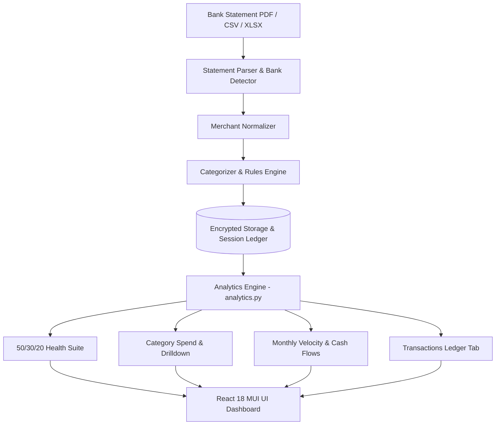

# Finance Buddy — Architecture

Complete personal finance analytics platform with four independent domains: Budget Analyzer (cash-flow analysis), Mutual Funds (portfolio analytics), Equity (direct stock tracking), and Tax Expert (income-tax computation).

This describes the system as it is. Where a design looks unusual, the reason is stated — most of the unusual choices trace back to one constraint (below) and are wrong to "clean up" without removing that constraint first.

Companion documents: **ONBOARDING.md** (setup), **API.md** (how to call APIs & pass tokens),
and **VERIFICATION.md** (setup validation).

---

## API prefixes by domain

| Domain | Prefix | Routers | API Example |
|---|---|---|---|
| Infrastructure | `/auth` `/market` `/accounts` `/history` | 4 routers | `GET /auth/me`, `GET /auth/users` (admin) |
| **Budget Analyzer** | `/budget/{portfolio,analytics,rules,accounts,insights}` | 5 routers | `POST /budget/portfolio/upload` |
| **Mutual Funds** | `/mutual-funds/*` | 9 routers | `GET /mutual-funds/overview/{sid}/summary` |
| **Tax Expert** | `/tax-expert` | 6 routers | `GET /tax-expert/{sid}/tax/summary` |
| **Equity** | `/equity/*` | 6 routers | `GET /equity/overview/{sid}/summary` |

---

## Frontend routes

Each domain owns a top-level path. `/dashboard` is the hub — the grid of the four
domains, and the way back out from inside one.

| Path | Renders |
|---|---|
| `/` | Landing (signed out) · redirects to `/dashboard` (signed in) |
| `/dashboard` | Domain hub |
| `/mutual-funds/*` | Mutual Funds (tabs: overview, holdings, performance, compare, journey, insights, history) |
| `/equity/*` | Indian Stocks |
| `/tax-expert/*` | Tax Expert |
| `/budget/*` | Budget Analyzer |
| `/accounts` | Account settings, export, purge |
| `/admin` | Admin Console (access requests, invites, user accounts) — shown in Topbar when `role=admin` |

Domains previously sat under `/dashboard/<domain>`. Those URLs still resolve —
`Dashboard.tsx` rewrites `/dashboard/<rest>` to `/<rest>`, preserving query and hash —
but new links should use the top-level form. The redirect and the ranking of
`dashboard` against `dashboard/*` are covered by `routes.test.ts`.

OAuth redirect URLs point at `/dashboard` and are unaffected.

---

## Backend structure

```
backend/
├── main.py                     # middleware, router mounting, lifespan
├── migrations/                 # 0001-0009 numbered SQL migrations
├── shared/
│   ├── db.py                   # single psycopg 3 connection pool
│   ├── crypto.py               # AES-256-GCM encryption
│   ├── identity.py             # user auth, ownership checks
│   ├── janitor.py              # periodic sweep registry (see below)
│   ├── session_stores.py       # resident-state registry (see below)
│   ├── reference/              # statutory data owned by no domain
│   │   └── capital_gains.json  # LTCG/STCG rates, holding periods
│   ├── services/
│   │   ├── returns.py          # trailing returns on any price/NAV series
│   │   ├── market_data.py      # AMFI / mfapi NAV bundles
│   │   ├── market_indices.py   # benchmark index series
│   │   └── cache.py            # in-process TTL cache
│   └── routers/                # /auth, /market, /accounts, /history
└── domains/
    ├── budget/                 # transaction parsing, categorization, rules, insights
    ├── mutual_funds/           # XIRR, allocation, peer comparison
    ├── tax_expert/             # capital gains, regime comparison
    └── equity/                 # holdings sync, sector analysis, P&L
```

### Keeping the domains independent

A domain must be removable without breaking the others. Two registries exist so
that cross-domain fan-out is not written as a hardcoded list of imports:

| Registry | Domains register | Consumed by |
|---|---|---|
| `shared/janitor.py` | a periodic sweep (`purge_expired`) | `main.py` lifespan starts one thread |
| `shared/session_stores.py` | `evict_user` / `forget_session` / `clear_all` | logout, account purge, cache clear, history delete |

Both are populated as an import side effect of each domain's session module, and
`main.py` logs the resulting roster at startup — a store that fails to register would
otherwise mean a purge silently evicts nothing.

Rules that hold today and are worth keeping:

- **No domain imports another domain.** Currently zero, backend and frontend.
- **`shared/` must not import from `domains/`.** One exception remains:
  `shared/routers/history.py` pulls `compute_xirr` for its mutual-funds-specific
  `/compare` handler, which belongs in that domain.
- **Statutory facts go in `shared/reference/`,** not in the domain that happens to
  need them first — capital-gains rates live there because Mutual Funds and Tax
  Expert are equally entitled to them.

---

## Database migrations

All migrations are idempotent and advisory-locked. Run with:

```bash
cd backend && python -m migrations.migrate
```

| # | What |
|---|---|
| 0001 | `users`, `identities`, `profiles`, `sessions`, `session_payloads`, `tax_payloads`, `app_settings` |
| 0002 | Row-level security, deny-all — a backstop behind the application's own authorization, not a replacement for it |
| 0003 | Move PII into application-encrypted columns (PAN, metrics, payloads) |
| 0004 | Budget: `budget_payloads`, `budget_rules` |
| 0005 | Budget rule versioning |
| 0006 | Budget hardening — brings the budget tables up to the schema conventions the rest already follow |
| 0007 | Budget accounts: `budget_account_meta`, `budget_envelopes`, `budget_merchant_aliases`, `budget_txn_flags` |
| 0008 | `access_requests` — public early-access form + admin allowlist |
| 0009 | `users.status`, `users.role` — pending / active / suspended; user / admin |

All are Postgres-validated by `test_sql_is_valid_postgres`.

---

## Frontend structure

```
frontend/src/
├── domains/
│   ├── budget/                 # BudgetDashboard, upload, sessions, insights
│   ├── mutual-funds/           # MF portfolio, holdings, insights
│   ├── tax-expert/             # Tax computation, ITR comparison
│   └── equity/                 # Stock holdings, sector allocation
└── shared/
    ├── auth/authClient.ts      # Supabase OAuth + access-status helpers
    ├── api/client.ts           # Axios + Bearer interceptor
    ├── components/admin/       # AdminConsole (access control UI)
    └── store/appStore.ts       # Zustand session store
```

---

## Budget Analyzer — Domain Architecture & Engines

The **Budget Analyzer** is a multi-bank personal finance engine built for Indian bank statements and transaction ledgers. It converts raw PDF, CSV, and Excel statements into actionable cash flow intelligence without requiring open banking credentials or screen scraping.

### Architecture & Data Pipeline



#### Pipeline Lifecycle:
1. **Upload**: User uploads a statement file via `UploadStatementModal.tsx`.
2. **Extraction**: `parser.py` parses tables, normalizes dates (`YYYY-MM-DD`), splits debit/credit amounts, and extracts descriptions.
3. **Enrichment**: `categorizer.py` matches keywords and custom rules to assign categories and payment modes (`UPI`, `NetBanking`, `Card`, `ATM`, `Cheque`).
4. **Persistence**: `sessions.py` persists encrypted session records in PostgreSQL and updates the user's aggregated master ledger.
5. **Analytics**: `analytics.py` executes vectorized pandas aggregations to deliver sub-millisecond KPI computations.

---

### Bank Statement Ingestion Pipeline

#### Parser Engine (`backend/domains/budget/parser.py`)
- **Password Protection**: Supports encrypted PDFs (e.g. DOB, PAN, Account number combinations).
- **Format Normalization**: Standardizes multi-column schemas into a unified transaction schema:
  - `date`: Transaction posting date (`YYYY-MM-DD`).
  - `narration`: Cleaned bank transaction description.
  - `merchant`: Extracted merchant/payee entity name.
  - `amount`: Absolute numeric transaction value.
  - `txn_type`: `debit` or `credit`.
  - `category`: Primary budget category.
  - `payment_mode`: Payment channel (`UPI`, `NetBanking`, `Card`, `ATM`, `Cheque`, etc.).
  - `balance`: Post-transaction balance (if provided).

#### Supported Banks (`backend/domains/budget/bank_config.json`)
- **HDFC Bank**: Savings & Current Account statements.
- **ICICI Bank**: Detailed transaction ledgers & Credit Card statements.
- **State Bank of India (SBI)**: Standard savings passbooks & e-statements.
- **Axis Bank**: Multi-column monthly statements.
- **Kotak Mahindra Bank**: NetBanking exports & PDF statements.
- **IndusInd & PNB**: Tabular statements.
- **Generic CSV / XLSX**: User-defined CSV/XLSX ledgers.

---

### Computational Engines & Financial Intelligence

#### 1. 50 / 30 / 20 Budget Health Evaluation Suite
Implements the macro-financial allocation framework:
- **Needs ($\le 50\%$)**: Fixed living obligations (Rent, Utilities, Groceries, EMI, Insurance, Healthcare, Education).
- **Wants ($\le 30\%$)**: Discretionary lifestyle spending (Dining, Shopping, Entertainment, Travel, Electronics, Hobbies).
- **Investments / Savings ($\ge 20\%$)**: Wealth generation & debt payoff (Mutual Funds, Equity, SIP, PPF, FD, RD, Gold, Crypto).

##### Health Scoring Algorithm:
$$\text{Health Score} = \max\left(0, \min\left(100, 100 - (\text{Needs Penalty} \times 1.2) - (\text{Wants Penalty} \times 1.0) - (\text{Invest Gap} \times 1.5)\right)\right)$$
- **Score $\ge 80$**: 🟢 *Excellent* (Prudent financial allocation)
- **Score $65 - 79$**: 🟡 *Good* (Balanced with slight lifestyle drift)
- **Score $50 - 64$**: 🟠 *Moderate* (Wants or fixed costs exceeding baseline)
- **Score $< 50$**: 🔴 *Needs Attention* (Under-investing or critical overspending)

#### 2. Category Spend Analytics & Payee Drilldown
- **Dynamic Category Chips**: Populates direct category badges based on transaction data with live spend totals (`Shopping • ₹45.2k`, etc.).
- **Debits (Outflows) vs Credits (Inflows)**: Dual-mode toggle.
- **Deep Drilldown**: Payee / merchant volume, average ticket size, and ranked merchant breakdowns.

#### 3. Cash Flow Velocity, Burn Rate & Liquidity Projections
- **Net Savings Rate**: $(\text{Inflows} - \text{Outflows}) / \text{Inflows} \times 100$.
- **Monthly Velocity**: Debit vs credit bar charts over time.
- **Cash Flow Balance Trend**: Cumulative liquid balance progression.
- **Burn Rate**: Average daily outflow and projected runway under existing cash balances.
- **Spending Shifts**: Detects month-over-month category expansion.

#### 4. Rule-Based Categorization Engine (`categorizer.py`, `rules_safety.py`)
- **Pattern Matching**: Evaluates user-defined rules in priority order.
- **Regex & Keyword Support**: Matches merchant names and raw narration text.
- **Batch Re-Categorization**: Updates category tags across past and future transactions.

---

### Multi-Level Dynamic Filtering System

Contextual In-Card Filters eliminate global filter clutter:

```
┌─────────────────────────────────────────────────────────────────────────────┐
│ 🌍 Global Filter Bar: Session (All vs Account) • Bank • Date Range          │
└─────────────────────────────────────────────────────────────────────────────┘
      │
      ├─── 💳 Cash Flow Trends Card
      │     └─ Local: [3M | 6M | 1Y | All] Range Toggle
      │
      ├─── 🏷️ Category Spend Analytics Card
      │     └─ Local: [Debits / Credits] • Min Amount Filter • Direct Category Chips
      │
      ├─── 🏪 Top Merchants Card
      │     └─ Local: [Outflows / Inflows] • Search Merchant • Sort By [₹ / Count]
      │
      └─── 📋 Transactions Tab
            └─ Local: Multi-column Filter Bar • Category Tagger • Full-text Search
```

---

### Budget Domain API Reference

The live OpenAPI schema at `GET /docs` is the source of truth for response contracts. Ownership is enforced inside `domains/budget/sessions.py` using verified user identities.

#### `/budget/accounts` — Bank & card accounts
| Method | Path | Purpose |
|---|---|---|
| `GET` | `/budget/accounts` | Every account seen across the user's statements, with balances and card utilisation. |
| `PUT` | `/budget/accounts/{account_key}` | Write fields a statement cannot supply. |

#### `/budget/analytics` — Overview, categories, transactions
| Method | Path | Purpose |
|---|---|---|
| `PUT` | `/budget/analytics/transactions/update` | Update transaction metadata / tags. |
| `GET` | `/budget/analytics/{session_id}/categories` | Category aggregation totals. |
| `GET` | `/budget/analytics/{session_id}/overview` | Dashboard headline aggregation, memoized on frame and filter set. |
| `GET` | `/budget/analytics/{session_id}/transactions` | Filtered transactions, paginated. |

#### `/budget/insights` — Transfers, recurring, forecast, anomalies, envelopes
| Method | Path | Purpose |
|---|---|---|
| `PUT` | `/budget/insights/envelopes` | Set or clear one category's monthly cap. |
| `PUT` | `/budget/insights/merchants/alias` | Remember a merchant rename. |
| `POST` | `/budget/insights/transfers/flag` | Override the pairing heuristic for one transaction. |
| `GET` | `/budget/insights/{session_id}/anomalies` | Duplicate charges, category spikes and unusual first-time merchants. |
| `GET` | `/budget/insights/{session_id}/coverage` | Statement coverage months per account and missing gaps. |
| `GET` | `/budget/insights/{session_id}/envelopes` | Spend against each monthly category cap with pace verdict. |
| `GET` | `/budget/insights/{session_id}/forecast` | Month-end projection and daily safe-to-spend figure. |
| `GET` | `/budget/insights/{session_id}/reconciliation` | Agreement between printed statement balance and transactions. |
| `GET` | `/budget/insights/{session_id}/recurring` | Subscriptions and standing charges with price changes. |
| `GET` | `/budget/insights/{session_id}/sankey` | Nodes and links for income → nature → category flow diagram. |
| `GET` | `/budget/insights/{session_id}/transfers` | Internal account movements netted out of income/expense. |

#### `/budget/portfolio` — Upload & sessions
| Method | Path | Purpose |
|---|---|---|
| `GET` | `/budget/portfolio/sessions` | List the caller's budget uploads. |
| `DELETE` | `/budget/portfolio/sessions/{session_id}` | Delete one budget upload. |
| `POST` | `/budget/portfolio/upload` | Parse bank/card statement (CSV / XLS / XLSX) into budget session. |

#### `/budget/rules` — Categorisation rules
| Method | Path | Purpose |
|---|---|---|
| `GET` | `/budget/rules` | List user rules. |
| `POST` | `/budget/rules` | Create rule. |
| `POST` | `/budget/rules/apply-all` | Apply rules across transactions. |
| `GET` | `/budget/rules/match-types` | Match types accepted by the server. |
| `POST` | `/budget/rules/test` | Test regex/keyword pattern against sample text. |
| `DELETE` | `/budget/rules/{rule_id}` | Delete rule. |

*Note*: `session_id` accepts a specific upload session ID or the literal `overall` (aggregating all uploaded accounts).

---

### Budget Frontend Component Architecture

All Budget components reside in `frontend/src/domains/budget/`:

| Component | Path | Responsibility |
|---|---|---|
| **BudgetDashboard** | `components/BudgetDashboard.tsx` | Master view: KPIs, charts, tab routing, and shared filter state. |
| **BudgetHealth503020Card** | `components/BudgetHealth503020Card.tsx` | Health score, 3 bucket cards, macro allocation strip, recommendations. |
| **TransactionsTab** | `components/TransactionsTab.tsx` | Transaction grid (client-paginated at 50 rows), inline category tagger, CSV export. |
| **AccountsTab** | `components/AccountsTab.tsx` | Per-account balances, card utilisation, editable account metadata. |
| **InsightsTab** | `components/InsightsTab.tsx` | Recurring charges, anomalies, envelope budgets, coverage gaps. |
| **MoneyFlowCard** | `components/MoneyFlowCard.tsx` | Income → nature → category Sankey diagram. |
| **TransfersExcludedCard** | `components/TransfersExcludedCard.tsx` | Net internal account transfer reconciliation. |
| **RulesTab** | `components/RulesTab.tsx` | Auto-categorization rule editor (create, edit, delete, priority reorder). |
| **UploadStatementModal** | `components/UploadStatementModal.tsx` | Multi-bank file uploader with password unlock support. |
| **BudgetSessionsModal** | `components/BudgetSessionsModal.tsx` | Account management modal for switching and deleting uploaded statements. |
| **useBudget** | `hooks/useBudget.ts` | Query hooks, cache keys, and invalidation for every budget endpoint. |
| **types** | `types.ts` | Response contracts for the budget API surface. |

---

### Adding Support for New Bank Formats

To add support for a new bank or custom statement schema:
1. Open `backend/domains/budget/bank_config.json`.
2. Add a new configuration entry matching the bank's header signature:
```json
{
  "bank_name": "NewBank",
  "signatures": ["Txn Date", "Value Date", "Description", "Ref No", "Debit", "Credit", "Balance"],
  "date_col": "Txn Date",
  "date_formats": ["%d/%m/%Y", "%d-%m-%Y"],
  "narration_col": "Description",
  "debit_col": "Debit",
  "credit_col": "Credit",
  "balance_col": "Balance"
}
```
3. `parser.py` automatically detects and matches uploaded statements against the signature list.

---

## Authentication & access control

Finance Buddy uses **admin-gated provisioning**: a Supabase Auth session alone is
not enough. The backend creates an app account only when the email is allowlisted.

### Two layers

| Layer | Store | Purpose |
|---|---|---|
| Auth | Supabase Auth | Sign-in (Google OAuth, email/password) |
| App account | `users` + `identities` + optional `profiles` | Authorization, PAN, domain data ownership |

The `users` row is inserted on **first authenticated request** (`users.resolve()`
in `IdentityMiddleware`), not when an admin clicks approve. Approval updates
`access_requests` and Supabase; sign-in creates or updates the app account.

### Account status & role (`users` table, migration 0009)

| Field | Values | Effect |
|---|---|---|
| `status` | `pending` | Signed in but blocked from app APIs except `/auth/me`, `/auth/logout`; frontend shows `PendingAccess` |
| `status` | `active` | Full access (after PAN gate) |
| `status` | `suspended` | Blocked like pending; frontend shows `SuspendedAccess` |
| `role` | `user` | Normal user |
| `role` | `admin` | Admin Console + admin-only `/auth/*` routes |

Bootstrap admins: email in `FINANCEBUDDY_ADMIN_EMAILS` → `active` + `admin` on
first provision. `_assert_admin()` denies all admin routes when the env list is
empty and the caller is not already `role=admin`.

### Allowlist rules (`users._may_provision`)

Provisioning is permitted when the email matches any of:

- `FINANCEBUDDY_ADMIN_EMAILS`
- `access_requests` row with `status = approved`
- `access_requests` row with `status = pending` (creates a pending app account so
  the user sees the wait screen instead of “raise request” after OAuth)

Otherwise `NotAuthorizedError` → `403 not_authorized` (no `users` row inserted).

### Auth API (`/auth`)

Full method/path catalog, rate limits, and curl examples:
**[API.md](API.md)** (single source of truth — do not duplicate the table here).

Summary: public `access-status` / `request-access`; signed-in `me` / `logout` /
`profile` / `profile/pan`; admin access-requests, invites, users (including hard delete).

### Middleware gates (`main.py` → `IdentityMiddleware`)

After identity resolution:

1. **`not_authorized`** — email not allowlisted; no app account created
2. **`pending`** — all paths blocked except `/auth/me`, `/auth/logout`
3. **`suspended`** — same as pending
4. **`active`** — normal routing; frontend may still gate on missing PAN

`PendingAccess` polls `/auth/me` every 15s so users enter the app shortly after
admin approval without a full page reload.

### Frontend auth screens

| Component | When |
|---|---|
| `Landing.tsx` | Signed out; request access; OAuth error / not-authorized messaging |
| `PendingAccess.tsx` | Signed in, `status=pending` |
| `SuspendedAccess.tsx` | Signed in, `status=suspended` |
| `AccountSetupPrompt` | Signed in, active; first-time password setup and/or missing PAN |
| `ProfilePage.tsx` | Route `/profile` (badge → Profile); display name, PAN, password; link to data vault |
| `AccountsDashboard` | Route `/accounts` (badge → Data vault); export / delete account data |
| `AdminConsole.tsx` | Route `/admin`; admin-only actions |
| `AdminOnly` (`Dashboard.tsx`) | UI gate: non-admins hitting `/admin` redirect to `/dashboard` (APIs still enforce admin) |

**Logout order:** `POST /auth/logout` (await) → Supabase `signOut` → clear local store.
Signing out without awaiting the backend can drop the Bearer token before resident
sessions are evicted.

---

## Security, Data Encryption & Privacy

### 1. Authentication & Identity
- **Bearer Token Verification**: `Authorization: Bearer <Supabase access_token JWT>` verified against the provider JWKS in `shared/oidc.py` with mandatory `exp`, `iss`, and `aud` checks. See [API.md](API.md) for how clients obtain and send the token.
- **Admin-gated provisioning**: First-time app accounts require an allowlisted email (see *Authentication & access control* above). Supabase public sign-up must be disabled in production.
- **PAN is Not Identity**: User identity is strictly keyed on UUID `users.id`. PAN is stored encrypted (`profiles.pan_encrypted`) solely for CAS/AIS matching; two users sharing a PAN cannot access each other's data.
- **Fail-Closed Authorization**: Handled at data retrieval layers (`sessions.py`, `identity.owns_record`). Unowned or unauthorized requests respond with `404 Not Found` (never 403) to prevent resource enumeration. Admin routes and unprovisioned sign-ins use explicit `403` responses where appropriate.

### 2. Encryption at Rest (AES-256-GCM)
- **Application-Level Envelope Encryption**: Sensitive columns (`profiles.pan_encrypted`, `sessions.metrics`, `session_payloads`, `tax_payloads.data`, `budget_payloads`) are encrypted via `shared/crypto.py` before hitting Postgres.
- **Randomized Nonces & Row-Binding**: Fresh nonce per write prevents ciphertext equality leakage. Ciphertexts are authenticated against `session_id`/`user_id` as GCM associated data, preventing row-swapping attacks.
- **No Plaintext Fallback**: The backend raises a fatal error if `FINANCEBUDDY_ENCRYPTION_KEYS` is unconfigured.

### 3. Data Retention & DPDP Compliance
- **Zero Third-Party Scraping**: Statements are parsed locally in-process without sharing credentials with aggregators. Uploaded raw PDFs/spreadsheets are cleaned up immediately from temporary storage upon parsing.
- **User-Controlled Retention**: Data persists until explicitly purged by the user (`DELETE /accounts/me`, `DELETE /history/{id}`, or `DELETE /budget/portfolio/sessions/{session_id}`).
- **Access & Portability**: Supported via full account data export (`GET /accounts/me/export`).

### 4. Response Caching & Logging Hygiene
- **Strict Anti-Caching Default**: All dynamic route responses default to `Cache-Control: no-store` via `DefaultCacheControlMiddleware`. `public` cache is restricted to user-independent market data.
- **PII Masking**: PAN and sensitive identifiers are masked to the last 4 characters (`identity.mask_pan`) in server logs.

---

## Stack

FastAPI · PostgreSQL 11+ (psycopg 3, no ORM) · pandas · React 18 · Vite · MUI · Zustand

Single uvicorn worker, ~512 MB RAM. See ONBOARDING.md for full setup and VERIFICATION.md to validate deployment.
