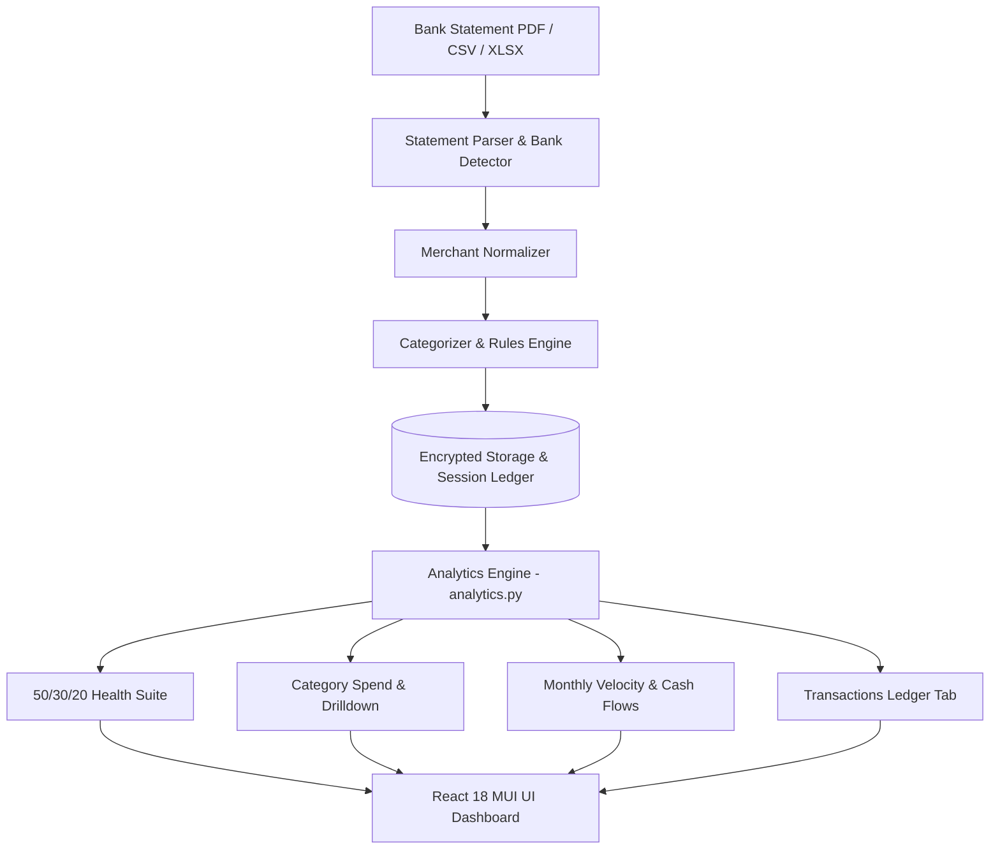

# Budget Analyzer & Multi-Account Cash Flow Intelligence

> **Comprehensive Technical Architecture, Computational Engines, API Reference, and User Guide for FinanceBuddy's Budget Analyzer.**

---

## 📑 Table of Contents
1. [Overview & Value Proposition](#overview--value-proposition)
2. [High-Level Architecture](#high-level-architecture)
3. [Bank Statement Ingestion Pipeline](#bank-statement-ingestion-pipeline)
4. [Computational Engines & Financial Intelligence](#computational-engines--financial-intelligence)
   - [50 / 30 / 20 Budget Health Evaluation Suite](#1-50--30--20-budget-health-evaluation-suite)
   - [Category Spend Analytics & Payee Drilldown](#2-category-spend-analytics--payee-drilldown)
   - [Cash Flow Velocity, Burn Rate & Liquidity Projections](#3-cash-flow-velocity-burn-rate--liquidity-projections)
   - [Rule-Based Categorization Engine](#4-rule-based-categorization-engine)
5. [Multi-Level Dynamic Filtering System](#multi-level-dynamic-filtering-system)
6. [API Reference](#api-reference)
7. [Frontend Component Architecture](#frontend-component-architecture)
8. [Adding Support for New Bank Formats](#adding-support-for-new-bank-formats)
9. [Security, Data Encryption & Privacy](#security-data-encryption--privacy)

---

## Overview & Value Proposition

The **Budget Analyzer** is a multi-bank personal finance engine built for Indian bank statements and transaction ledgers. It converts raw PDF, CSV, and Excel statements into actionable cash flow intelligence without requiring open banking credentials or screen scraping.

### Core Capabilities:
- **Multi-Bank Ingestion**: Native auto-detection and parsing for HDFC, ICICI, SBI, Axis, Kotak, IndusInd, PNB, and standard CSV formats.
- **Multi-Account Aggregation**: View single accounts in isolation or all accounts combined in a unified "Overall" master ledger.
- **50 / 30 / 20 Budget Health Evaluation**: Real-time adherence scoring, bucket cushion calculations, and AI recommendations.
- **Contextual In-Card Filters**: Card-level toggles (debit/credit, payment modes, min amount thresholds, direct category chips) that don't reset the rest of your dashboard.
- **Deep Payee & Merchant Drilldown**: Instant sub-allocation breakdown of any category showing transaction counts, ticket sizes, and ranked merchants.
- **Customizable Rule Engine**: Regex and keyword rules that automatically categorize future uploads.

---

## High-Level Architecture



### Data Pipeline Lifecycle:
1. **Upload**: User uploads a statement file via `UploadStatementModal.tsx`.
2. **Extraction**: `parser.py` parses tables, normalizes dates (`YYYY-MM-DD`), splits debit/credit amounts, and extracts descriptions.
3. **Enrichment**: `categorizer.py` matches keywords and custom rules to assign categories and payment modes (`UPI`, `NetBanking`, `Card`, `ATM`, `Cheque`).
4. **Persistence**: `sessions.py` persists encrypted session records in SQLite / Postgres and updates the user's aggregated master ledger.
5. **Analytics**: `analytics.py` executes vectorized pandas aggregations to deliver sub-millisecond KPI computations.

---

## Bank Statement Ingestion Pipeline

### Parser Engine (`backend/domains/budget/parser.py`)
The parser handles differences in statement formats across Indian financial institutions:
- **Password Protection**: Supports encrypted PDFs (e.g. DOB, PAN, Account number combinations).
- **Format Normalization**: Standardizes multi-column schemas into a unified transaction schema:
  - `date`: Transaction posting date (`YYYY-MM-DD`).
  - `narration`: Cleaned bank transaction description.
  - `merchant`: Extracted merchant/payee entity name.
  - `amount`: Absolute numeric transaction value.
  - `txn_type`: `debit` or `credit`.
  - `category`: Primary budget category.
  - `payment_mode`: Payment channel (`UPI`, `NetBanking`, `Card`, `ATM`, `Cheque`, etc.).
  - `balance`: Post-transaction balance (if provided).

### Supported Banks (`backend/domains/budget/bank_config.json`)
- **HDFC Bank**: Savings & Current Account statements.
- **ICICI Bank**: Detailed transaction ledgers & Credit Card statements.
- **State Bank of India (SBI)**: Standard savings passbooks & e-statements.
- **Axis Bank**: Multi-column monthly statements.
- **Kotak Mahindra Bank**: NetBanking exports & PDF statements.
- **IndusInd & PNB**: Tabular statements.
- **Generic CSV**: User-defined CSV/XLSX ledgers.

---

## Computational Engines & Financial Intelligence

### 1. 50 / 30 / 20 Budget Health Evaluation Suite
Implements the macro-financial framework:
- **Needs ($\le 50\%$)**: Fixed living obligations (Rent, Utilities, Groceries, EMI, Insurance, Healthcare, Education).
- **Wants ($\le 30\%$)**: Discretionary lifestyle spending (Dining, Shopping, Entertainment, Travel, Electronics, Hobbies).
- **Investments / Savings ($\ge 20\%$)**: Wealth generation & debt payoff (Mutual Funds, Equity, SIP, PPF, FD, RD, Gold, Crypto).

#### Health Scoring Algorithm:
$$\text{Health Score} = \max\left(0, \min\left(100, 100 - (\text{Needs Penalty} \times 1.2) - (\text{Wants Penalty} \times 1.0) - (\text{Invest Gap} \times 1.5)\right)\right)$$
- **Score $\ge 80$**: 🟢 *Excellent* (Prudent financial allocation)
- **Score $65 - 79$**: 🟡 *Good* (Balanced with slight lifestyle drift)
- **Score $50 - 64$**: 🟠 *Moderate* (Wants or fixed costs exceeding baseline)
- **Score $< 50$**: 🔴 *Needs Attention* (Under-investing or critical overspending)

#### Real-Time Bucket Metrics:
- **Actual ₹ Spend & \% Allocation**
- **Target Budget Thresholds**
- **Cushion vs Over-Budget Status**
- **AI-Powered Recommended Actions**: Specific ₹ amounts to adjust to reach the 20% investment baseline.

---

### 2. Category Spend Analytics & Payee Drilldown
- **Dynamic Category Chips**: Populates direct category badges based on transaction data with live spend totals (`Uncategorized • ₹12.3L`, `Shopping • ₹45.2k`).
- **Debits (Outflows) vs Credits (Inflows)**: Dual-mode toggle.
- **Deep Drilldown**: Clicking any category transitions the card into a deep drilldown mode with:
  - **Category Volume & Average Ticket Size**
  - **Payee / Merchant Donut Chart**
  - **Ranked Merchant Breakdown with Progress Bars**

---

### 3. Cash Flow Velocity, Burn Rate & Liquidity Projections
- **Net Savings Rate**: $(\text{Inflows} - \text{Outflows}) / \text{Inflows} \times 100$.
- **Monthly Velocity**: Side-by-side debit vs credit bar charts over time.
- **Cash Flow Balance Trend**: Cumulative liquid balance progression line chart.
- **Burn Rate**: Average daily outflow and projected runway under existing cash balances.
- **Biggest Spending Shift**: Detects highest month-over-month category expansion.

---

### 4. Rule-Based Categorization Engine (`backend/domains/budget/rules.py`)
- **Pattern Matching**: Evaluates user-defined rules in priority order.
- **Regex & Keyword Support**: Matches merchant names and raw narration text.
- **Batch Re-Categorization**: Updates category tags across past and future transactions.

---

## Multi-Level Dynamic Filtering System

The Budget Analyzer uses **Contextual In-Card Filters** to eliminate global clutter:

```
┌─────────────────────────────────────────────────────────────────────────────┐
│ 🌍 Global Filter Bar: Session (All vs Account) • Bank • Date Range          │
└─────────────────────────────────────────────────────────────────────────────┘
      │
      ├─── 💳 Cash Flow Trends Card
      │     └─ Local: [3M | 6M | 1Y | All] Range Toggle
      │
      ├─── 🏷️ Category Spend Analytics Card
      │     └─ Local: [Debits / Credits] • Min Amount Filter • Direct Category Chips
      │
      ├─── 🏪 Top Merchants Card
      │     └─ Local: [Outflows / Inflows] • Search Merchant • Sort By [₹ / Count]
      │
      └─── 📋 Transactions Tab
            └─ Local: Multi-column Filter Bar • Category Tagger • Full-text Search
```

---

## API Reference

### 1. Upload Statement
`POST /api/budget/upload`
- **Request**: `multipart/form-data` containing `file`, optional `bank`, and `password`.
- **Response**:
```json
{
  "session_id": "sess_91283a0f",
  "bank": "HDFC",
  "account_type": "Savings",
  "transaction_count": 284,
  "date_range": { "start": "2025-01-01", "end": "2025-12-31" },
  "total_debits": 482910.50,
  "total_credits": 620000.00
}
```

### 2. Get Budget Overview
`GET /api/budget/overview?session_id=overall&bank=all&account_type=all&date_range=all`
- **Response**:
```json
{
  "total_inflow": 620000.00,
  "total_outflow": 482910.50,
  "net_savings": 137089.50,
  "savings_rate": 22.11,
  "burn_rate": { "daily_average": 1323.04, "monthly_average": 40242.54 },
  "health_metrics": {
    "score": 78,
    "grade": "Good",
    "needs_pct": 48.2,
    "wants_pct": 29.7,
    "invest_pct": 22.1
  },
  "monthly_trends": [
    { "month": "2025-01", "inflow": 50000, "outflow": 42000, "net": 8000 }
  ],
  "top_merchants": [
    { "merchant": "Swiggy", "amount": 14200, "count": 18, "category": "Food & Dining" }
  ]
}
```

### 3. Get Category Breakdown & Drilldown
`GET /api/budget/category_breakdown?session_id=overall&flow=debit&category=Food%20%26%20Dining`
- **Response**:
```json
{
  "is_drilldown": true,
  "category": "Food & Dining",
  "category_stats": {
    "total_amount": 34820.00,
    "count": 42,
    "avg_ticket": 829.05,
    "merchants": [
      { "merchant": "Zomato", "amount": 18200.00, "count": 22, "percentage": 52.3 },
      { "merchant": "Swiggy", "amount": 16620.00, "count": 20, "percentage": 47.7 }
    ]
  }
}
```

### 4. Categorize Transaction & Create Rule
`POST /api/budget/categorize`
- **Request**:
```json
{
  "txn_id": "txn_81920",
  "category": "Investments",
  "apply_rule": true,
  "rule_keyword": "ZERODHA"
}
```

---

## Frontend Component Architecture

All Budget components reside in `frontend/src/domains/budget/`:

| Component | Path | Responsibility |
|---|---|---|
| **BudgetDashboard** | `components/BudgetDashboard.tsx` | Master view orchestrating KPIs, charts, and in-card contextual filter states. |
| **BudgetHealth503020Card** | `components/BudgetHealth503020Card.tsx` | Health Score gauge, 3 bucket cards, macro allocation strip, and AI tips. |
| **TransactionsTab** | `components/TransactionsTab.tsx` | Filterable virtualized transaction grid with inline category tagger and CSV export. |
| **RulesTab** | `components/RulesTab.tsx` | Auto-categorization rule editor (create, edit, delete, priority reorder). |
| **UploadStatementModal** | `components/UploadStatementModal.tsx` | Multi-bank file uploader with password unlock support. |
| **BudgetSessionsModal** | `components/BudgetSessionsModal.tsx` | Account management modal for toggling and deleting uploaded statements. |
| **useBudget** | `hooks/useBudget.ts` | React Hook managing data fetching, caching, and state synchronization. |

---

## Adding Support for New Bank Formats

To add support for a new bank or custom statement schema:
1. Open `backend/domains/budget/bank_config.json`.
2. Add a new configuration entry matching your bank's table header signatures:
```json
{
  "bank_name": "NewBank",
  "signatures": ["Txn Date", "Value Date", "Description", "Ref No", "Debit", "Credit", "Balance"],
  "date_col": "Txn Date",
  "date_formats": ["%d/%m/%Y", "%d-%m-%Y"],
  "narration_col": "Description",
  "debit_col": "Debit",
  "credit_col": "Credit",
  "balance_col": "Balance"
}
```
3. `parser.py` will automatically match uploaded files against the new configuration signature.

---

## Security, Data Encryption & Privacy

- **Zero Third-Party Scraping**: Statements are parsed locally on your server without sharing credentials with aggregation aggregators.
- **Envelope Encryption**: Persisted session records are encrypted at rest using AES-GCM via `backend/shared/storage.py`.
- **Tenant Isolation**: Every database query verifies `user_id` ownership using verified Supabase JWT claims.
- **Session Privacy**: Users can permanently purge individual statements or their entire budget database at any time.
