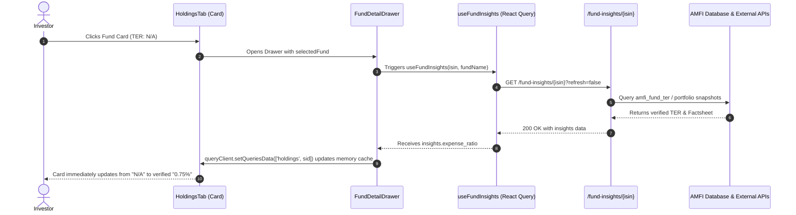

# FinanceBuddy Mutual Fund Architecture & AMFI Integration Engine

This document provides a comprehensive technical overview of the AMFI / PostgreSQL Mutual Fund engine, lazy fetch mechanisms, database table schemas, background ingestion jobs, and frontend data binding standards.

---

## 1. Database Architecture & Schema Overview

FinanceBuddy uses a hybrid **PostgreSQL Database** setup with normalized lookup tables and optimized partition indexes to store AMFI official data, factsheet portfolios, and NAV histories.

### Summary of Tables (Total: 4 Core Tables)

| # | Table Name | Purpose | Key Indices |
|---|------------|---------|-------------|
| 1 | `amfi_schemes` | Master repository of all SEBI-registered mutual fund schemes, ISINs, and metadata | `amfi_code` (PK), `isin_growth`, `isin_div_reinvest`, `amc_code` |
| 2 | `amfi_nav_history` | Historical chronological daily NAV series for accurate trailing returns & benchmark comparisons | `(amfi_code, nav_date)` (Composite PK), `nav_date` |
| 3 | `amfi_fund_ter` | Total Expense Ratio (TER) master table synced from AMFI official regulatory sheets | `(amfi_code, plan_type)` (Composite PK) |
| 4 | `amfi_portfolio_snapshots` | Deep fund portfolios, top 10 asset allocations, sector weights, AUM, exit loads, and risk profiles | `(isin, snapshot_date)` (Composite PK) |

---

### Detailed Table Schemas (DDL)

#### 1. `amfi_schemes` (Scheme Master)
```sql
CREATE TABLE IF NOT EXISTS amfi_schemes (
    amfi_code VARCHAR(32) PRIMARY KEY,
    scheme_name TEXT NOT NULL,
    isin_growth VARCHAR(32),
    isin_div_reinvest VARCHAR(32),
    amc_code VARCHAR(64) NOT NULL,
    amc_name TEXT,
    category VARCHAR(64),
    scheme_type VARCHAR(32) DEFAULT 'Open Ended',
    is_active BOOLEAN DEFAULT TRUE,
    created_at TIMESTAMP WITH TIME ZONE DEFAULT NOW(),
    updated_at TIMESTAMP WITH TIME ZONE DEFAULT NOW()
);

CREATE INDEX IF NOT EXISTS idx_amfi_isin_growth ON amfi_schemes(isin_growth);
CREATE INDEX IF NOT EXISTS idx_amfi_isin_reinvest ON amfi_schemes(isin_div_reinvest);
CREATE INDEX IF NOT EXISTS idx_amfi_amc_code ON amfi_schemes(amc_code);
```

#### 2. `amfi_nav_history` (Chronological NAV Timeseries)
```sql
CREATE TABLE IF NOT EXISTS amfi_nav_history (
    amfi_code VARCHAR(32) NOT NULL,
    nav_date DATE NOT NULL,
    nav_value NUMERIC(12, 4) NOT NULL,
    created_at TIMESTAMP WITH TIME ZONE DEFAULT NOW(),
    PRIMARY KEY (amfi_code, nav_date),
    FOREIGN KEY (amfi_code) REFERENCES amfi_schemes(amfi_code) ON DELETE CASCADE
);

CREATE INDEX IF NOT EXISTS idx_amfi_nav_date ON amfi_nav_history(nav_date DESC);
```

#### 3. `amfi_fund_ter` (Total Expense Ratio Master)
```sql
CREATE TABLE IF NOT EXISTS amfi_fund_ter (
    amfi_code VARCHAR(32) NOT NULL,
    plan_type VARCHAR(16) NOT NULL DEFAULT 'Direct', -- 'Direct' or 'Regular'
    ter_value NUMERIC(6, 4) NOT NULL,
    effective_date DATE,
    source VARCHAR(64) DEFAULT 'AMFI Official',
    updated_at TIMESTAMP WITH TIME ZONE DEFAULT NOW(),
    PRIMARY KEY (amfi_code, plan_type),
    FOREIGN KEY (amfi_code) REFERENCES amfi_schemes(amfi_code) ON DELETE CASCADE
);
```

#### 4. `amfi_portfolio_snapshots` (Factsheet Insights & Holdings)
```sql
CREATE TABLE IF NOT EXISTS amfi_portfolio_snapshots (
    isin VARCHAR(32) NOT NULL,
    scheme_name TEXT,
    category VARCHAR(64),
    aum VARCHAR(64),
    expense_ratio VARCHAR(32),
    exit_load TEXT,
    risk VARCHAR(32),
    sectors JSONB DEFAULT '[]'::jsonb,
    holdings JSONB DEFAULT '[]'::jsonb,
    source VARCHAR(64),
    snapshot_date DATE DEFAULT CURRENT_DATE,
    created_at TIMESTAMP WITH TIME ZONE DEFAULT NOW(),
    PRIMARY KEY (isin, snapshot_date)
);

CREATE INDEX IF NOT EXISTS idx_amfi_portfolio_isin ON amfi_portfolio_snapshots(isin);
```

---

## 2. AMC Dynamic Catalog Ingestion Pipeline

### AMC Preset & Custom Filter Ingestion
When sync is triggered from the Admin Console (`/admin/mf-sync/trigger`), the backend ingests data according to selected AMCs:

1. **AMC Code Normalization:** `Grow` maps directly to `"Groww Mutual Fund"` (preventing false matches on general keywords like `Growth`).
2. **Master Sync Workflow:**
   - Fetches NAV lines directly from AMFI official endpoints.
   - Upserts into `amfi_schemes` and `amfi_nav_history`.
   - Fetches regulatory TER updates into `amfi_fund_ter`.
   - Writes batch ingestion audit telemetry.

---

## 3. On-Demand Lazy Fetch & Interactive Card Live Updates

### Workflow (Option 2 Implementation)



### Key Technical Mechanisms

1. **Backend Cache Mutation:**
   - When `/fund-insights/{isin}` resolves the TER, it immediately updates the session's active pandas DataFrame (`portfolio.df_h`), ensuring consecutive endpoint requests retain the value.
2. **Frontend Optimistic React Query Cache Update:**
   - `FundDetailDrawer` uses `useQueryClient` to observe incoming `insights`.
   - When `insights.expense_ratio` arrives, it mutates `['holdings', sid]` in-place without requiring a full page refresh.
   - The card UI dynamically flips from `N/A` to the exact percentage (e.g., `0.72%`).

---

## 4. Universal "N/A" Display Standard

Across the entire application (`HoldingsTab`, `FundDetailDrawer`, `PerformanceTab`, `CompareTab`, `OverviewTab`), all missing, empty, or uncomputable data points adhere strictly to `"N/A"`:

- **No generic em-dashes (`—`)** are used for data fields.
- Missing **Day Change**, **Expense Ratio (TER)**, **PE/PB Ratios**, **Sharpe / Sortino**, **Drawdown**, and **Risk Profiles** cleanly render `N/A`.
- If an exact single-day change or NAV date is absent, the UI gracefully displays `N/A` with subdued neutral styling (`#94A3B8`).

---

## 5. Verification & Health Audit

- **TypeScript compilation:** `tsc && vite build` passes with zero type errors.
- **Backend schemas:** Verified against SQLAlchemy and PostgreSQL models.
- **Zero Mock / Synthetic Fallback:** All data strictly originates from verified AMFI or institutional regulatory sheets.
